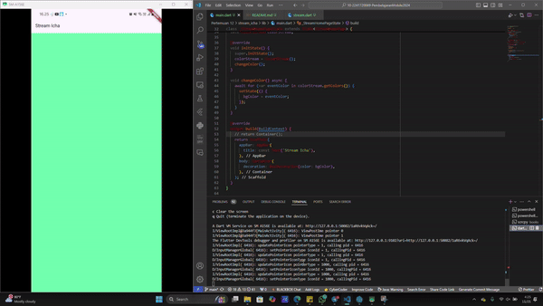
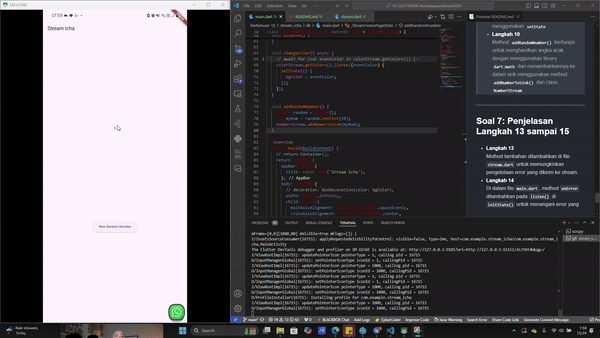
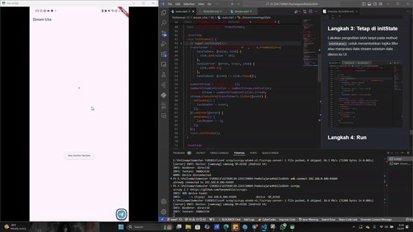
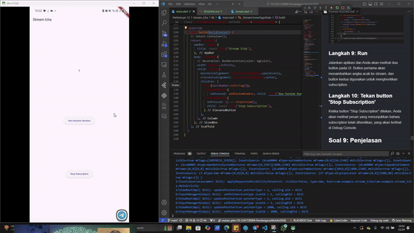
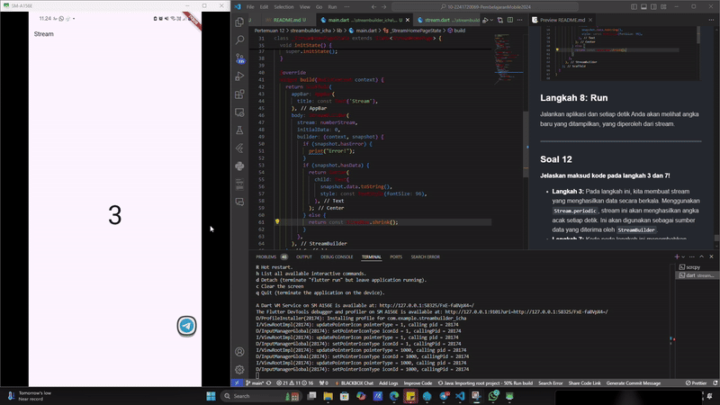
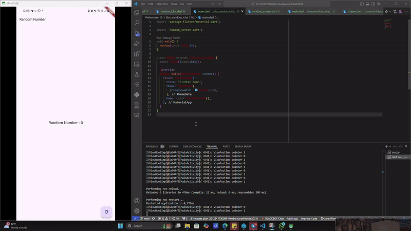

# Pertemuan 12 - Lanjutan State Management dengan Streams

<table>
    <thead>
        <th style="text-align: center;" colspan="2">Data Diri</th>
    </thead>
    <tbody>
        <tr>
            <td>Nama</td>
            <td>Icha Dewi Putriana</td>
        </tr>
        <tr>
            <td>Nim</td>
            <td>2241720069</td>
        </tr>
    </tbody>
</table>

---
## Praktikum 1 - Dart Streams
---

### Langkah 1: Buat Project Baru  
Project Flutter bernama `stream_[nama_panggilan]` berhasil dibuat di folder `week-12/src/` pada repository GitHub.

### Langkah 2: Buka File main.dart  

>Soal 1:  
> - Tambahkan nama panggilan Anda pada title app sebagai identitas hasil pekerjaan Anda.
> - Gantilah warna tema aplikasi sesuai kesukaan Anda.  

### Langkah 3: Buat File Baru stream.dart  
File `stream.dart` telah berhasil ditambahkan di dalam folder `lib` project.

### Langkah 4: Tambah Variabel Colors  

> Soal 2:  
> - Menambahkan 5 warna sesuai keinginan di variabel colors 
 

### Langkah 5: Tambah Method getColors()  
Method `getColors()` ditambahkan dengan fitur **async*** untuk men-stream data secara asinkron.

### Langkah 6: Tambah Perintah yield*  

> Soal 3:  
> - Fungsi keyword `yield*:` yield*`  digunakan untuk mengirimkan data dari stream atau daftar lain ke dalam stream saat ini. Dengan yield*, kita bisa langsung mengalirkan data yang dihasilkan oleh stream lain tanpa perlu menulis kode tambahan. Jadi, yield* membuat stream kita bisa mengambil dan mengirimkan data dari stream atau iterable lain secara otomatis.  
> - `yield*` digunakan untuk mengalirkan data dari stream lain. Pada kode ini, `Stream.periodic` menghasilkan warna setiap detik dengan memilih warna berdasarkan indeks yang dihitung menggunakan waktu `(t % colors.length)`. Ini memastikan bahwa warna akan berulang setelah mencapai warna terakhir di daftar `colors`.  

### Langkah 7 : Buka main.dart
Ketik kode impor file ini pada file main.dart

### Langkah 8: Tambah variabel
Ketik dua properti ini di dalam class _StreamHomePageState

### Langkah 9: Tambah method changeColor()
Tetap di file main, Ketik kode seperti berikut

### Langkah 10: Lakukan override initState()

### Langkah 11: Ubah isi Scaffold()

### Langkah 12: Run  
Aplikasi berhasil dijalankan. Background aplikasi berubah warna setiap detik sesuai stream yang dibuat.  

> Soal 4:  
> - Hasil capture berupa GIF telah disertakan dalam laporan ini.  
> 

### Langkah 13: Ganti Isi Method changeColor()  

> Soal 5:  
> - Perbedaan `listen` dan `await for`:  
>   - `listen`: Digunakan untuk mendengarkan data yang dihasilkan oleh stream tanpa perlu menunggu setiap elemen selesai diproses. Ini cocok untuk proses paralel atau jika data tidak harus ditunggu satu per satu.  
>   - `await for`: Menunggu setiap elemen dari stream untuk diproses satu per satu sebelum melanjutkan ke elemen berikutnya, cocok untuk alur yang membutuhkan kontrol sekuensial.  

>**Catatan** : Stream di Flutter sangat berguna untuk menangani data secara asinkron, seperti dalam skenario real-time messaging, unggah dan unduh file, pelacakan lokasi, atau pengelolaan data IoT.

---

## Laporan Praktikum 2: Stream Controllers dan Sinks
Tujuan dalam praktikum ini adalah Memahami penggunaan StreamController, sink, dan stream dalam Flutter serta mengimplementasikan aliran data menggunakan StreamController.

---

### Langkah 1
Melakukan import library `dart:async` untuk menggunakan StreamController.

### Langkah 2
Menambahkan class `NumberStream` yang berfungsi untuk mengelola data stream secara terpusat.

### Langkah 3
Menambahkan variabel `StreamController` di dalam class `NumberStream` untuk mengatur sink dan stream.

### Langkah 4
Menambahkan method `addNumberToSink()` pada class `NumberStream` untuk memasukkan data ke dalam sink.

### Langkah 5
Menambahkan method `close()` pada class `NumberStream` untuk menutup StreamController ketika tidak lagi digunakan.

### Langkah 6
Melakukan import `dart:async` dan `dart:math` ke dalam file `main.dart`.

### Langkah 7
Menambahkan variabel beberapa variabel di dalam class `_StreamHomePageState`.

### Langkah 8
Mengedit method `initState()` untuk mendengarkan data dari stream menggunakan `listen()`.

### Langkah 9
Mengedit method `dispose()` untuk menutup StreamController dengan memanggil method `close()`.

### Langkah 10
Menambahkan method `addRandomNumber()` untuk menghasilkan angka acak dan memasukkannya ke dalam sink.

### Langkah 11
Mengedit method `build()` untuk menampilkan data stream di UI.

### Langkah 12
Menjalankan aplikasi Flutter dan memastikan hasil sesuai.

---

>Soal 6: Penjelasan Langkah 8 dan 10
>
> 
>- *Langkah 8*  
Pada langkah ini, `initState()` diubah untuk mendengarkan data yang mengalir melalui stream menggunakan method `listen()`. Dengan demikian, setiap kali ada data baru di stream, UI dapat diperbarui secara real-time menggunakan `setState`
>- *Langkah 10*   
Method `addRandomNumber()` berfungsi untuk menghasilkan angka acak dengan menggunakan library `dart:math` dan menambahkannya ke dalam sink menggunakan method `addNumberToSink()` dari class `NumberStream`.

---

## Langkah 13 : Buka stream.dart
Tambahkan method `addError()`

## Langkah 14 : Buka main.dart
Tambahkan method `onError` di dalam `class StreamHomePageState` pada method `listen` di fungsi `initState()` seperti berikut ini.

## Langkah 15 : Edit method addRandomNumber()
Lakukan comment pada dua baris kode berikut, lalu ketik kode seperti berikut ini.

---
>Soal 7: 
> 1. Penjelasan Langkah 13 sampai 15 
>
>    
>    - *Langkah 13*  
Method tambahan yang ditambahkan di file `stream.dart` digunakan untuk Mengirimkan sebuah *error* ke *sink* stream menggunakan `controller.sink.addError('error')`. Ini akan memicu mekanisme penanganan *error* pada *listener* stream.
>    - *Langkah 14*  
Kode `stream.listen((event) { ... }).onError((error) { ... });` digunakan untuk menerima data dari stream dan memperbarui `lastNumber`. Jika terjadi error, `onError` akan memperbarui `lastNumber` menjadi -1 sebagai tanda error.
>    - *Langkah 15*  
Pada method `addRandomNumber()`, kode untuk menambahkan angka ke sink dimodifikasi untuk mengilustrasikan cara mengirim error menggunakan `addError()`.
>  2. Kembalikan kode seperti semula pada Langkah 15, comment addError() agar Anda dapat melanjutkan ke praktikum 3 berikutnya.
>  

---
## Laporan Praktikum 3: Injeksi Data ke Streams

Tujuan dari praktikum ini adalah memahami penggunaan `StreamTransformers` untuk memanipulasi atau mentransformasi data stream, termasuk proses filtering, validasi, atau modifikasi data sebelum data sampai pada UI end user.

---

#### Langkah 1: Buka main.dart  
Tambahkan variabel baru di dalam class `_StreamHomePageState` untuk menampung stream yang telah dimodifikasi atau diolah.

### Langkah 2: Tambahkan kode ini di initState  
Pada method `initState()`, tambahkan kode yang menggunakan `StreamTransformer` untuk melakukan transformasi pada data stream, seperti memfilter angka tertentu.

### Langkah 3: Tetap di initState  
Lakukan pengeditan lebih lanjut pada method `initState()` untuk menambahkan logika filter atau manipulasi data stream sebelum data dikirim ke UI.

### Langkah 4: Run 
Menjalankan aplikasi Flutter dengan cara menekan **F5** atau melakukan **hot restart** untuk melihat hasil implementasi pada UI. Hasilnya akan menampilkan angka dari 0 hingga 90 sesuai dengan logika transformasi yang telah ditambahkan.

---

> Soal 8: Penjelasan Langkah 1-3
>
> 
> - Kode ini membuat aplikasi yang menggunakan stream untuk mengubah dan menampilkan data secara real-time. Di initState(), stream angka diproses dengan StreamTransformer untuk mengalikan nilai angka dengan 10 sebelum ditampilkan di UI. Jika terjadi error, UI menampilkan nilai -1. Fungsi addRandomNumber() menambahkan angka acak ke stream. UI menampilkan angka terakhir yang diterima dari stream dan tombol untuk menghasilkan angka acak. Aplikasi ini menunjukkan penggunaan stream untuk memanipulasi data dan memperbarui tampilan secara dinamis.

---

## Laporan Praktikum 4: Subscribe ke Stream Events
Pada praktikum ini, kita akan belajar cara menggunakan `Subscription` untuk menangani event dan error pada stream secara terstruktur, serta menutup `Subscription` tersebut dengan teknik praktik baik (best practice).

---

### Langkah 1: Tambah variabel  
Tambahkan variabel baru di dalam class `_StreamHomePageState` yang digunakan untuk menampung `Subscription` stream yang akan dikelola.

### Langkah 2: Edit initState()  
Modifikasi method `initState()` untuk memulai proses listening terhadap stream menggunakan `listen()` dan menangani event serta error menggunakan teknik yang tepat.

### Langkah 3: Tetap di initState()  
Tambahkan kode yang memungkinkan untuk menambahkan logika tambahan pada stream, seperti menangani kondisi error atau proses lainnya sebelum data diteruskan.

### Langkah 4: Tambah properti onDone()  
Tambahkan properti `onDone()` setelah properti `onError()`. Properti ini akan menangani kondisi ketika stream selesai dan tidak ada data yang akan dikirimkan lagi.

### Langkah 5: Tambah method baru  
Ketik method baru dalam class `_StreamHomePageState` yang akan digunakan untuk menangani event tertentu, seperti berhenti dari subscription.

### Langkah 6: Pindah ke method dispose()  
Jika method `dispose()` belum ada, buat method ini dengan menggunakan `@override`. method ini akan menutup subscription untuk mencegah memory leak.

### Langkah 7: Pindah ke method build()  
Tambahkan button kedua di method `build()`. Button ini digunakan untuk menghentikan subscription ketika ditekan oleh pengguna.

### Langkah 8: Edit method addRandomNumber()  
Edit kode pada method ini untuk menambah fungsionalitas dalam menambahkan angka secara acak ke stream yang sedang didengarkan.

### Langkah 9 & 10 : Run & Tekan button 'Stop Subscription' 
Jalankan aplikasi dan akan menampilkan dua button pada UI. Button pertama akan menambahkan angka acak ke stream, dan button kedua digunakan untuk menghentikan subscription. Ketika button "Stop Subscription" ditekan, maka akan ada pesan yang menunjukkan bahwa subscription telah dihentikan, yang akan terlihat di Debug Console.

> Soal 9: Penjelasan Langkah 2, 6, dan 8
>
> 
>- *Langkah 2: Edit initState()*  
Pada langkah ini, `initState()` dimodifikasi untuk memulai proses listening pada stream dengan menggunakan method `listen()`. Di sini, kita juga menangani event dan error dengan menggunakan properti `onData`, `onError`, dan `onDone`. Proses ini memastikan bahwa aliran data dari stream dapat diterima dan ditangani dengan benar.
>- *Langkah 6: Pindah ke method dispose()*  
Method `dispose()` bertanggung jawab untuk menutup subscription ketika widget tidak lagi diperlukan atau ketika aliran data stream selesai. Ini adalah praktik terbaik untuk mencegah memory leak. Pada langkah ini, kita memanggil `cancel()` pada `Subscription` untuk menghentikan aliran data stream dan membebaskan sumber daya.
>- *Langkah 8: Edit method addRandomNumber()*  
Pada method ini, kita menambahkan angka acak ke dalam stream menggunakan `add()` atau metode lain yang relevan. Angka yang ditambahkan ini akan dikirim melalui stream dan dapat diterima oleh subscriber yang mendengarkan stream tersebut.

---
## Laporan Praktikum 5: Multiple Stream Subscriptions

Pada praktikum ini, kita belajar tentang penggunaan stream dengan multiple subscriptions menggunakan broadcast stream. Stream biasanya hanya dapat digunakan untuk satu subscription, namun dengan broadcast stream, kita bisa mendengarkan stream dari beberapa subscriber secara bersamaan tanpa menimbulkan error.

---
### Langkah 1: Buka file `main.dart`
Pada langkah pertama, Anda diminta untuk menambahkan variabel baru di dalam class `_StreamHomePageState` untuk menyiapkan stream yang akan digunakan dalam aplikasi.

### Langkah 2: Edit `initState()`
Pada `initState()`, kita menyiapkan stream dan subscription. Namun, jika kita mencoba melakukan multiple subscriptions pada stream biasa, maka aplikasi akan menampilkan error.

### Langkah 3: Run
Jika aplikasi dijalankan tanpa pengaturan broadcast stream, error akan terjadi saat mencoba melakukan subscription lebih dari satu kali pada stream yang sama. Error ini terjadi karena stream default hanya mendukung satu subscription, dan tidak bisa diakses oleh lebih dari satu listener pada saat yang bersamaan.

>Soal 10
> 1. Jelaskan mengapa error itu bisa terjadi?
>     - Error terjadi karena stream biasa hanya dapat memiliki satu subscription aktif pada satu waktu. Jika ingin membuat subscription kedua pada stream yang sama, maka aplikasi akan memberikan error karena stream tersebut tidak mendukung multiple subscriptions secara default. Untuk mengatasi masalah ini, maka harus mengubah stream menjadi broadcast stream.

### Langkah 4: Set Broadcast Stream
Pada langkah ini, Anda diminta untuk mengubah stream menjadi broadcast stream di dalam `initState()`. Broadcast stream memungkinkan lebih dari satu listener untuk menerima event yang sama, sehingga memungkinkan multiple subscriptions tanpa error.

### Langkah 5: Edit Method `build()`
Kemudian, pada method `build()`, kita menambahkan teks yang akan menampilkan hasil angka acak yang dihasilkan dari stream, sehingga dapat terlihat bahwa angka yang sama muncul di beberapa tempat pada UI.

### Langkah 6: Run
Setelah melakukan perubahan pada langkah-langkah sebelumnya, jalankan aplikasi dan tekan button 'New Random Number' beberapa kali. akan menampilkan angka yang muncul dua kali di layar karena ada dua subscription yang mendengarkan stream yang sama.

---
> Soal 11
>
> 
> 1. Jelaskan mengapa hal itu bisa terjadi?
>     - Hal ini terjadi karena setelah mengubah stream menjadi broadcast, kita dapat memiliki lebih dari satu listener yang menerima event dari stream yang sama. Setiap kali button ditekan, angka baru ditambahkan ke stream dan kedua listener yang terdaftar (subscription) akan menerima data yang sama. maka angka yang muncul akan terlihat dua kali di layar.

---

## Laporan Praktikum 6: StreamBuilder

Pada praktikum ini, kita belajar tentang penggunaan `StreamBuilder` di Flutter untuk membangun UI secara reaktif yang akan diperbarui setiap kali data baru tersedia dari stream. Praktikum ini melanjutkan dari praktikum sebelumnya yang menggunakan multiple subscriptions dan broadcast streams.

### Langkah 1: Buat Project Baru
Buat project Flutter baru dengan nama `streambuilder_nama` di dalam folder `week-12/src/` dalam repository GitHub Anda.

### Langkah 2: Buat File Baru `stream.dart`
Pada langkah ini, Anda diminta untuk membuat file baru bernama `stream.dart` dan menambahkan kode untuk mengatur stream dan logika yang akan digunakan untuk menghasilkan data secara periodik.

### Langkah 3: Tetap di File `stream.dart`
Tambahkan kode berikut untuk menyiapkan stream yang menghasilkan angka secara acak setiap detik. Stream ini akan digunakan untuk memberi data ke `StreamBuilder`.

Kode pada langkah 3 berfungsi untuk membuat stream yang secara berkala mengirimkan data (angka acak) ke subscriber yang mendengarkan stream tersebut. Dengan menggunakan `Stream.periodic`, data dikirim setiap detik ke listener.

### Langkah 4: Edit `main.dart`
Pada langkah ini, kita mengubah file `main.dart` untuk memasukkan `StreamBuilder`. Di sini, `StreamBuilder` akan mendengarkan stream yang telah dibuat dan membangun UI berdasarkan data yang diterima.

### Langkah 5: Tambah Variabel
Di dalam `class _StreamHomePageState`, tambahkan variabel untuk stream.

### Langkah 6: Edit `initState()`
Pada `initState()`, kita mulai mendengarkan stream yang telah disiapkan sebelumnya. Kita juga menyiapkan subscription yang akan mendengarkan data secara berkala.

### Langkah 7: Edit Method `build()`
Dalam method `build()`, kita menambahkan widget `StreamBuilder`. Widget ini akan membangun UI setiap kali ada data baru yang diterima dari stream.

#### Penjelasan Kode Langkah 7
Kode pada langkah 7 berfungsi untuk membuat `StreamBuilder` yang akan secara otomatis membangun ulang UI ketika data baru datang dari stream. `StreamBuilder` akan menampilkan angka baru yang dikirimkan setiap detik, sehingga UI tetap terupdate dengan informasi terbaru.

### Langkah 8: Run
Jalankan aplikasi dan setiap detik Anda akan melihat angka baru yang ditampilkan, yang diperoleh dari stream.

---
> Soal 12
>
> 
> 1. Jelaskan maksud kode pada langkah 3 dan 7!
>    - **Langkah 3:** Pada langkah ini, kita membuat stream yang menghasilkan data secara berkala. Menggunakan `Stream.periodic`, stream ini akan menghasilkan angka acak setiap detik. Ini akan digunakan sebagai sumber data yang diterima oleh `StreamBuilder`.
>    - **Langkah 7:** Kode pada langkah ini menambahkan `StreamBuilder` dalam method `build()`. `StreamBuilder` bertugas untuk mendengarkan stream dan membangun UI secara otomatis setiap kali ada data baru yang tersedia. Ketika data baru diterima, `StreamBuilder` akan memanggil callback dan memperbarui tampilan UI dengan data yang diterima.

---

## Laporan Praktikum 7: BLoC Pattern

Praktikum ini bertujuan untuk memahami dan mengimplementasikan **pola BLoC (Business Logic Component)** pada aplikasi Flutter. Pola ini digunakan untuk memisahkan logika bisnis dari presentasi UI, sehingga memungkinkan kode yang lebih terorganisir, dapat digunakan kembali, dan mudah diisolasi untuk pengujian.

---

### **Langkah 1: Buat Project Baru**
- Buat project Flutter baru dengan nama `bloc_random_nama` di folder `week-12/src/` repository GitHub.
- Tambahkan file baru `random_bloc.dart` di dalam folder `lib`.

### **Langkah 2: Isi Kode `random_bloc.dart`**
Tambahkan kode impor untuk library yang diperlukan, seperti `dart:async` untuk menangani stream.

### **Langkah 3: Buat Class `RandomNumberBloc`**
Class ini akan menjadi inti dari BLoC yang menangani logika bisnis pembuatan angka acak dan mengatur aliran data menggunakan stream.

### **Langkah 4: Buat Variabel `StreamController`**
`StreamController` digunakan untuk membuat aliran data (stream). Dalam class `RandomNumberBloc`, `StreamController` akan mengelola input (event) dan output (state).

### **Langkah 5: Buat Constructor**
Constructor ini menghubungkan input (event) ke output (state) menggunakan `StreamController`.

### **Langkah 6: Buat Method `dispose()`**
Method ini digunakan untuk menutup `StreamController` ketika BLoC tidak lagi digunakan, mencegah memory leak.

### **Langkah 7: Edit `main.dart`**
Tambahkan kode untuk menyiapkan aplikasi utama yang menggunakan pola BLoC dengan UI.

### **Langkah 8: Buat File Baru `random_screen.dart`**
Tambahkan file baru di dalam folder `lib` untuk mendefinisikan layar utama aplikasi.

### **Langkah 9: Impor `Material` dan `random_bloc.dart`**
Tambahkan impor pada file `random_screen.dart` untuk mengakses library material dan class `RandomNumberBloc`.

### **Langkah 10: Buat StatefulWidget `RandomScreen`**
Widget ini akan menjadi layar utama aplikasi yang menampilkan angka acak dan tombol untuk memicu event.

### **Langkah 11: Buat Variabel**
Di dalam `class _RandomScreenState`, tambahkan variabel untuk instance dari `RandomNumberBloc`.

### **Langkah 12: Buat Method `dispose()`**
Tutup `RandomNumberBloc` di method `dispose()` untuk membersihkan sumber daya.

### **Langkah 13: Edit Method `build()`**
Tambahkan UI berupa `Text` untuk menampilkan angka acak dan `FloatingActionButton` untuk memicu event pembuatan angka baru.

> Soal 13
>
>
> - Praktikum ini bertujuan untuk memperkenalkan dan mempraktikkan pola **BLoC** dalam Flutter. Dengan menggunakan BLoC, logika bisnis dipisahkan dari UI, sehingga kode menjadi lebih modular, dapat digunakan kembali, dan lebih mudah diuji.
> - Letak Konsep Pola BLoC
>a. `StreamController:` Mengatur aliran data antara sumber data dan subscriber. 
>      - Input (event) diatur melalui `StreamSink`.
>      - Output (state) diatur melalui `Stream`.
>
>    b. `RandomNumberBloc:` Class ini menjadi inti dari BLoC yang menangani logika bisnis (menghasilkan angka acak) dan mengelola aliran data menggunakan stream.
>c. `UI:` Menggunakan aliran data (stream) dari BLoC untuk memperbarui tampilan angka acak setiap kali event terjadi (tekan tombol).

---