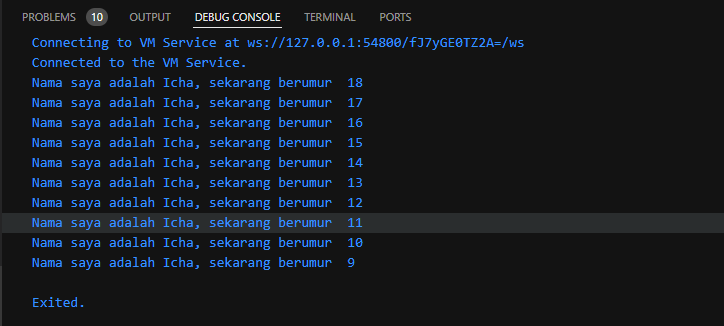

|   |   |
|---|---|
| Nama    | Icha Dewi Putriana  |
| Kelas   | TI - 3F             |
| NIM     | 2241720069          |


# **Praktikum 1 - Pengantar Bahasa Pemograman DART**
---

### Soal 1
Modifikasilah kode pada baris 3 di VS Code atau Editor Code favorit Anda berikut ini agar mendapatkan keluaran (output) sesuai yang diminta!

> *Modifikasi Code*
```dart
void main() {
  for (int i = 19; i > 9; i--) {
    print('Nama saya adalah Icha, sekarang berumur  ${i - 1}');
  }
}
```

>*Hasil Output dari Code Dart yang dimodifikasi*
 



## *Soal 2*
Mengapa sangat penting untuk memahami bahasa pemrograman Dart sebelum kita menggunakan framework Flutter ? Jelaskan!

> Jawab : Memahami bahasa dart sangat penting sebelum menggunakan framework flutter karena bahasa dart adalah inti yang digunakan di dalam framework Flutter.

## *Soal 3*
Rangkumlah materi dari codelab ini menjadi poin-poin penting yang dapat Anda gunakan untuk membantu proses pengembangan aplikasi mobile menggunakan framework Flutter.
  >**Fitur Utama Dart:**
      >- **Tooling**: Alat bantu untuk memudahkan penulisan dan pengujian kode.
      >- **Garbage Collection**: Mengelola memori secara otomatis.
      >- **Type Annotations**: Opsional, membantu dalam keamanan dan konsistensi data.
      >- **Statically typed:** Meskipun type annotations bersifat opsional, Dart tetap aman karena menggunakan fitur type-safe dan type inference untuk menganalisis types saat runtime. Fitur ini penting untuk menemukan bug selama kompilasi kode.
      >- **Portability:** bahasa Dart tidak hanya untuk web (yang dapat diterjemahkan ke JavaScript) tetapi juga dapat dikompilasi secara native ke kode Advanced RISC Machines (ARM) dan x86.

>**Kompilasi dan Eksekusi Kode:**
    >- **JIT (Just-In-Time)**: Mengkompilasi kode saat aplikasi dijalankan, sehingga perubahan kode bisa langsung terlihat. Sangat berguna saat pengembangan karena mendukung **debugging** dan **hot reload**, yang mempercepat proses pengujian.
    >- **AOT (Ahead-Of-Time)**: Mengkompilasi kode sebelum aplikasi berjalan, memberikan performa lebih tinggi. Cocok untuk aplikasi yang siap dirilis, namun tidak mendukung **debugging** dan **hot reload**, sehingga setiap perubahan membutuhkan kompilasi ulang.

>**Kemiripan dengan Bahasa Lain:**
    >- **Sintaks**: Mirip dengan **C** dan **JavaScript**, memudahkan pemahaman.
    >- **Object-Oriented Programming (OOP)**: Menggunakan **class**, **inheritance**, dan **polymorphism**.

>**Operator Dart:**
  *Di Dart, operator seperti == adalah method khusus di dalam class. Misalnya, x == y sebenarnya memanggil method x.==(y) untuk membandingkan kesetaraan. Semua tipe data di Dart adalah objek, jadi operator dapat diubah sesuai kebutuhan melalui method dalam class.*
    >- **Aritmatika**: `+`, `-`, `*`, `/`, `~/` (pembagian bulat), `%` (modulus).
    >- **Increment/Decrement**: `++`, `--`.
    >- **Perbandingan**: `==`, `!=`, `>`, `<`, `>=`, `<=`.
    >- **Logika**: `!` (negasi), `||` (OR), `&&` (AND).

>**Type Safety:**
    >- **Dart** memastikan keamanan tipe data tanpa membutuhkan operator `===` seperti di **JavaScript**.


