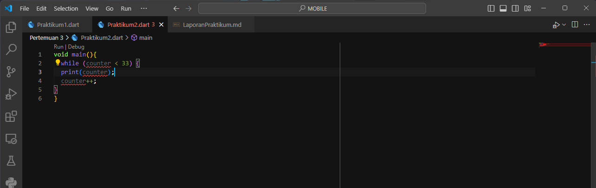
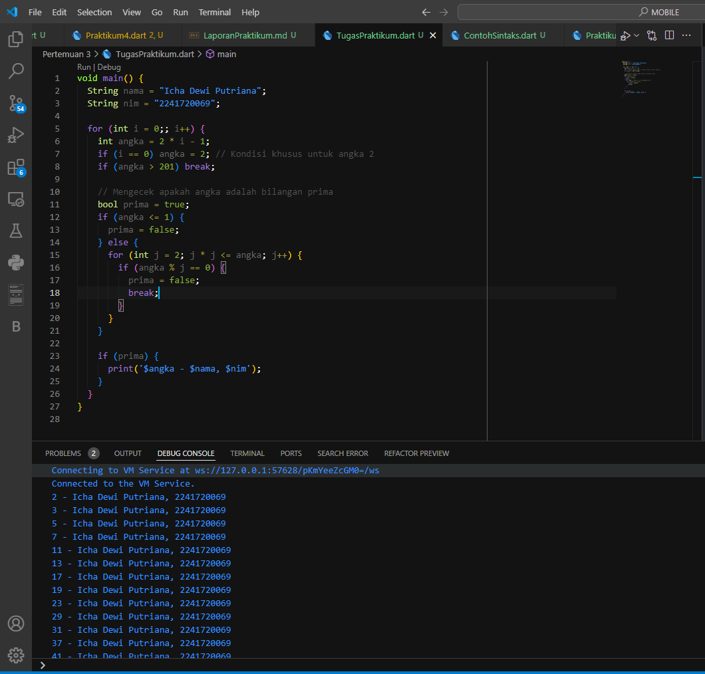

# **Pengantar Bahasa Pemograman Dart Bagian - 2**
---

Pada pengantar bahasa pemrograman Dart bagian 3 ini, Anda akan melakukan praktik untuk bereksperimen dengan control flows (if/else) dan perulangan.

## **Praktikum 1 - Menerapkan Control Flows ("if/else")**
---
Di JavaScript, pemeriksaan dua variable dapat menggunakan double `"=="` atau triple `"===".` Untuk double `"=="` hanya membandingkan nilainya saja, sedangkan triple `"==="` dibandingkan dengan tipe datanya. Contohnya dalam JavaScript, `"7" == 7` akan bernilai true, tetapi `"7" === 7` akan bernilai false. Ini bisa jadi sebuah bug jika Anda lupa dengan operator ini. Dart cukup menggunakan double `"=="` untuk membandingkan nilai sekaligus tipe datanya.

### **Langkah 1**
Ketik atau salin kode progam berikut ke dalam fungsi `main()`.

### **Langkah 2**

>Akan terdapat error pada kode yang di salin karena penulisan if else disitu menggunakan huruf kapital untuk awalanya.

Hasil perbaikan kode

>Gambar di atas menunjukkan hasil perbaikan kode yang telah diubah menjadi huruf kecil. Output-nya adalah `"test2"` dan `"test2 again"` karena di awal didefinisikan bahwa `variabel test berisi string "test2"`. Pada perulangan kedua, terdapat blok `elseif` yang menyatakan bahwa `jika test sama dengan "test2", maka akan mencetak "test2"`. Ada juga pernyataan `if` di bawahnya yang memiliki kondisi bahwa `jika test sama dengan "test2", maka akan mencetak "test2 again"`.

### **Langkah 3**
Tambahkan kode progam berikut, lalu eksekusi kode anda.

> Akan terjadi error pada kode tersebut karena variabel `test` sudah ada dan telah didefinisikan sebelumnya, sehingga nama variabelnya harus diganti. Selain itu, terdapat kesalahan karena `kondisi pada pernyataan if belum didefinisikan` dengan benar.

Hasil perbaikan kode 

> Saya mengganti nama variabel nya yg awalnya `test` menjadi `test2`  agar tidak ada konflik dengan variabel `test` yang sudah ada. Juga saya menambahkan kondisi di if nya. Outputnya adalah `"Kebenaran"` karena memenuhi kondisi dari if nya.

## **Praktikum 2 - Menerapkan Perulangan "while" dan "do-while"**
---
Selesaikan langkah-langkah praktikum berikut ini menggunakan dartPad di browser Anda.

### **Langkah 1**
Ketik atau salin kode progam berikut ke dalam fungsi `main()`

>Akan terjadi error karena `counter` belum di inisialisasi. 

### **Langkah 2**
Silakan coba eksekusi (Run) kode pada langkah 1 tersebut. Apa yang terjadi? Jelaskan! Lalu perbaiki jika terjadi error.

> Saya menambahkan type data int pada counter dan memberi nilai awal 30 untuk counter. Hasil output-nya adalah program akan mencetak nilai counter mulai dari 30, dan terus bertambah satu per satu selama nilai counter bernilai kurang dari 33, jadi angka 33 tidak akan dicetak dan progam akan berhenti.

### **Langkah 3**
Tambahkan kode program berikut, lalu coba eksekusi (Run) kode Anda.

> Pada perulangan while, kondisi dicek dulu sebelum blok kode dijalankan, sehingga jika kondisi tidak terpenuhi, blok kode tidak akan dieksekusi. Pada kode ini, nilai counter dimulai dari 30, dan program mencetak angka 30 hingga 32 karena perulangan berhenti saat counter mencapai 33.

> Pada do-while, blok kode akan dieksekusi minimal sekali, lalu kondisi dicek setelahnya. jadi 77 akan tetap dicetak terlebih dahulu baru melihat kondisinya.

## **Praktikum 3 - Menerapkan Perulangan "for" dan "break-continue"**
---
Selesaikan langkah-langkah praktikum berikut ini menggunakan DartPad di browser Anda.

### **Langkah 1**
Ketik  atau salin kode progam berikut ke dalam fungsi `main()`

> Terjadi error karena variabel belum dikasih type data

### **Langkah 2**
Silakan coba eksekusi (Run) kode pada langkah 1 tersebut. Apa yang terjadi? Jelaskan! Lalu perbaiki jika terjadi error.

>  Saya menambahkan type data int pada variabel `index` dan memberi increment di akhir kondisi. Outputnya adalah Program berjalan menggunakan perulangan for dari nilai awal index = 10 hingga index < 27, sehingga program mencetak nilai index dari 10 hingga 26. 

### **Langkah 3**
Tambahkan kode program berikut di dalam for-loop, lalu coba eksekusi (Run) kode Anda.

>akan terjadi error karena penulisanya yang berantakan

hasil perbaikan

> Output program tersebut akan mencetak angka dari 10 hingga 21, namun akan berhenti setelah mencetak 21 karena ada perintah break saat index == 21. Baris perintah else if (index > 1 || index < 7) continue; tidak berpengaruh karena semua nilai index yang dicetak berada di luar kondisi tersebut. Jadi, hasil akhirnya adalah angka 10 hingga 21 tanpa mencetak nilai ganda.

## **Tugas Praktikum**
---

1. Silakan selesaikan Praktikum 1 sampai 3, lalu dokumentasikan berupa screenshot hasil pekerjaan beserta penjelasannya!
2. Buatlah sebuah program yang dapat menampilkan bilangan prima dari angka 0 sampai 201 menggunakan Dart. Ketika bilangan prima ditemukan, maka tampilkan nama lengkap dan NIM Anda.
3. Kumpulkan berupa link commit repo GitHub pada tautan yang telah disediakan di grup Telegram!

> Progam nya adalah sebagai berikut:

