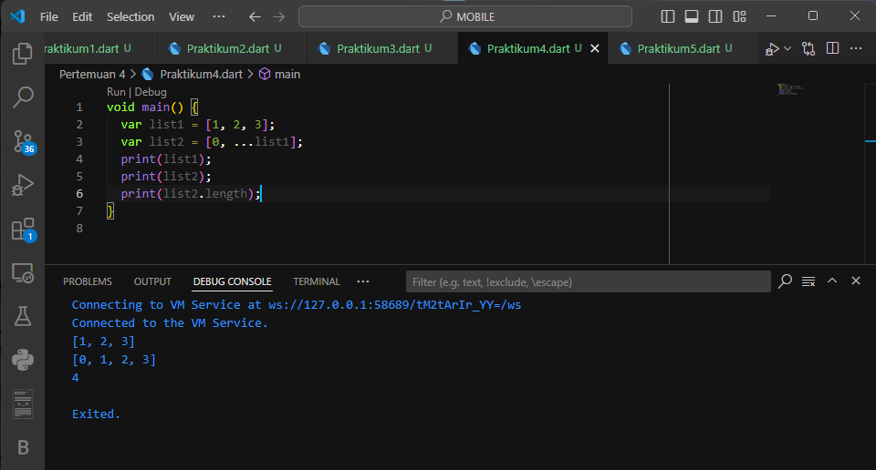
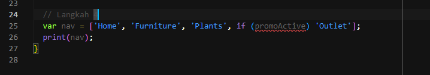

# **Pengantar Bahasa Pemrograman Dart - Bagian 3**

---

Pada pengantar bahasa pemrograman Dart bagian 3 ini, Anda akan melakukan praktik untuk bereksperimen dengan colletctions, records, dan functions. Hal ini cukup penting diketahui terutama bagi Anda yang belum memiliki dasar pemrograman sebelumnya.

Dengan mempelajari materi ini, Anda diharapkan mampu untuk menerapkannya pada Framework Flutter untuk menangani data dalam bentuk collections dan record serta memanfaatkan functions.

## **Praktikum 1 - Eksperimen Tipe Data List**

---

### **Langkah 1**

Ketik atau salin kode progam berikut ke dalam `void main()`


### **Langkah 2**

penjelasan kode program di atas adalah sebagai berikut:

> Kode memodifikasi elemen list di Dart. Awalnya, list [1, 2, 3] diverifikasi dengan assert untuk panjang dan elemen kedua. Setelah mengubah elemen kedua menjadi 1, perubahan tersebut juga diverifikasi dan dicetak. Hasil menunjukkan panjang list tetap 3, dan elemen kedua berubah dari 2 menjadi 1.

### **Langkah 3**

Ubah kode pada langkah 1 menjadi variabel final yang mempunyai `index = 5` dengan `default value = null`. Isilah nama dan NIM Anda pada elemen index ke-1 dan ke-2. Lalu print dan capture hasilnya.


## **Praktikum 2 - Eksperimen Tipe Data Set**

---

### **Langkah 1**

Ketik atau salin kode program berikut ke dalam fungsi `main()`.


### **Langkah 2**

penjelasan kode program di atas adalah sebagai berikut:

> Output menampilkan elemen-elemen dari Set halogens dalam kurung kurawal, tanpa urutan tertentu. Hasilnya sesuai dengan elemen-elemen yang didefinisikan di dalam Set.

### **Langkah 3**

Tambahkan kode program berikut, lalu coba eksekusi (Run) kode Anda.

Tambahkan elemen nama dan NIM Anda pada kedua variabel Set tersebut dengan dua fungsi berbeda yaitu `.add()` dan `.addAll()`.


## **Praktikum 3 - Eksperimen Tipe Data Maps**

---

### **Langkah 1**

Ketik atau salin kode program berikut ke dalam fungsi `main()`


### **Langkah 2**

penjelasan kode program di atas adalah sebagai berikut :

> Kode mendefinisikan dua Map: gifts dengan kunci string dan nobleGases dengan kunci angka. Output menunjukkan pasangan kunci-nilai dari kedua Map sesuai definisi, yaitu `{first: partridge, second: turtledoves, fifth: 1}` dan `{2: helium, 10: neon, 18: 2}`.

### **Langkah 3**

Tambahkan elemen nama dan NIM Anda pada tiap variabel di atas (gifts, nobleGases, mhs1, dan mhs2).

```dart
void main() {
  // Langkah 1
  print("     Langkah 1     ");
  print("-------------------");
  var gifts = {
    // Key:    Value
    'first': 'partridge',
    'second': 'turtledoves',
    'fifth': 1
  };

  var nobleGases = {
    2: 'helium',
    10: 'neon',
    18: 2,
  };

  print(gifts);
  print(nobleGases);

  // Langkah 3
  var mhs1 = Map<String, String>();
  gifts['first'] = 'partridge';
  gifts['second'] = 'turtledoves';
  gifts['fifth'] = 'golden rings';

  var mhs2 = Map<int, String>();
  nobleGases[2] = 'helium';
  nobleGases[10] = 'neon';
  nobleGases[18] = 'argon';

  // Menambahkan elemen nama dan NIM pada setiap Map
  gifts['name'] = 'Icha Dewi Putriana';
  gifts['NIM'] = '2241720069';

  nobleGases[0] = 'Icha Dewi Putriana';
  nobleGases[1] = '2241720069';

  mhs1['name'] = 'Icha Dewi Putriana';
  mhs1['NIM'] = '2241720069';

  mhs2[0] = 'Icha Dewi Putriana';
  mhs2[1] = '2241720069';

  // Mencetak hasil
  print("\n\n       Langkah 3       ");
  print("---------------------------");
  print('gifts: $gifts');
  print('nobleGases: $nobleGases');
  print('mhs1: $mhs1');
  print('mhs2: $mhs2');
}

```

Hasil output


## Praktikum 4 - Eksperimen Tipe Data List : Spread dan Control-flow Operators

---

### **Langkah 1**

Ketik atau salin kode program berikut ke dalam fungsi `main()`


### **Langkah 2**

Silakan coba eksekusi (Run) kode pada langkah 1 tersebut. Apa yang terjadi? Jelaskan! Lalu perbaiki jika terjadi error.



Penjelasan kode :

> Kode Dart tersebut menghasilkan tiga baris output. Baris pertama menunjukkan isi dari list list1 yaitu [1, 2, 3]. Baris kedua menampilkan isi list list2 yang merupakan gabungan dari angka 0 dan semua elemen di list1, sehingga hasilnya adalah [0, 1, 2, 3]. Baris terakhir menunjukkan panjang dari list list2 yang bernilai 4, sesuai dengan jumlah elemen di dalamnya. Konsep spread operator yang digunakan pada pembuatan list2 memungkinkan kita untuk dengan mudah menambahkan semua elemen dari satu list ke list yang lain.

### **Langkah 3**

Tambahkan kode program berikut, lalu coba eksekusi (Run) kode Anda.


Apa yang terjadi ? Jika terjadi error, silakan perbaiki.

> Hasil perbaikan

Tambahkan variabel list berisi NIM Anda menggunakan Spread Operators.


### **Langkah 4**

Tambahkan kode program berikut, lalu coba eksekusi (Run) kode Anda.



Apa yang terjadi ? Jika terjadi error, silakan perbaiki. Tunjukkan hasilnya jika variabel promoActive ketika true dan false.

> Hasil True


> Hasil False


### **Langkah 5**

Tambahkan kode program berikut, lalu coba eksekusi (Run) kode Anda.

```dart
var nav2 = ['Home', 'Furniture', 'Plants', if (login case 'Manager') 'Inventory'];
print(nav2);
```

Apa yang terjadi ? Jika terjadi error, silakan perbaiki. Tunjukkan hasilnya jika variabel login mempunyai kondisi lain.

> Hasil login = 'Staff'


> Hasil login = 'Manager'


### **Langkah 6**

Tambahkan kode program berikut, lalu coba eksekusi (Run) kode Anda.


Apa yang terjadi ? Jika terjadi error, silakan perbaiki. Jelaskan manfaat Collection For dan dokumentasikan hasilnya.

> Kode menggunakan Collection For untuk membuat `listOfStrings` dari `listOfInts` dengan menambahkan `# `di depan setiap elemen.

> **Manfaat Collection For**
>
> - Ringkas dan Ekspresif: Memungkinkan kode yang lebih singkat dan mudah dipahami.
> - Fleksibilitas: Cocok untuk berbagai jenis koleksi Dart seperti List, Set, atau Map.
> - Mudah Memanipulasi Data: Memungkinkan manipulasi elemen-elemen koleksi dengan mudah saat membuat koleksi baru.
> - Optimasi Kinerja: Membantu dalam mengoptimalkan kinerja aplikasi terutama untuk pembuatan koleksi besar.
> - Penggunaan yang Intuitif: Syntax yang intuitif memudahkan penggunaan dan implementasi dalam kode Dart.

## **Praktikum 5 - Eksperimen Tipe Data Records**

---

### **Langkah 1**

Ketik atau salin kode program berikut ke dalam fungsi `main()`.


### **Langkah 2**

penjelasan kode program di atas adalah sebagai berikut :

> Penggunaan tuple dalam kode tersebut memungkinkan pengelompokan berbagai jenis data dalam satu struktur. Dengan mendefinisikan elemen seperti string dan pasangan nama-nilai, program dapat menyimpan informasi yang relevan secara terorganisir.

### **Langkah 3**

Tambahkan kode program berikut di luar scope `void main()`, lalu coba eksekusi (Run) kode Anda.

Gunakan fungsi `tukar()` di dalam `main()` sehingga tampak jelas proses pertukaran value field di dalam Records.


### **Langkah 4**

Tambahkan kode program berikut di dalam scope void main(), lalu coba eksekusi (Run) kode Anda.


Inisialisasi field nama dan NIM Anda pada variabel record mahasiswa di atas.


### **Langkah 5**

Tambahkan kode program berikut di dalam scope void `main()`, lalu coba eksekusi (Run) kode Anda.


Gantilah salah satu isi record dengan nama dan NIM Anda


## **Tugas Praktikum**

---

1. Jelaskan yang dimaksud Functions dalam bahasa Dart!
   > **Jawab :** Function atau fungsi dalam Dart adalah blok kode yang dirancang untuk melakukan tugas tertentu. Fungsi dapat menerima input berupa parameter dan mengembalikan output. Penggunaan fungsi membantu dalam mengorganisir kode, mempermudah pemeliharaan, dan meningkatkan keterbacaan.
1. Jelaskan jenis-jenis parameter di Functions beserta contoh sintaksnya!

   > **Jawab :** Ada empat jenis parameter dalam fungsi Dart, yaitu
   >
   > - **Parameter yang Wajib (Required Parameter)**: Parameter ini harus diberikan nilai saat pemanggilan fungsi. Dart menggunakan anotasi required untuk menandai parameter yang wajib diisi. Contoh:

   ```dart
   void main() {
       print(calculateArea(width: 5, height: 10)); // Output: 50
   }
   int calculateArea({required int width, required int height}) {
       return width * height;
   }
   ```

   > - **Parameter yang Opsional (Optional Parameter)**: Parameter ini bersifat opsional dan dapat memiliki nilai default. Jika tidak diberikan nilai saat pemanggilan fungsi, maka nilai default akan digunakan. Contoh:

   ```dart
   void main() {
     print(add(3, 5)); // Output: 8
   }

   int add(int x, int y) {
     return x + y;
   }
   ```

   > - **Parameter yang Dapat Dikirimkan Lebih dari Satu (Named Parameter )**: Parameter ini ditentukan dengan nama saat pemanggilan fungsi, sehingga lebih jelas dan mudah dibaca. Named parameters juga dapat memiliki nilai default.

   ```dart
   void main() {
     print(calculateArea(width: 5, height: 10)); // Output: 50
   }

   int calculateArea({int width = 0, int height = 0}) {
     return width * height;
   }
   ```

   > - **Parameter yang Dapat Dikirimkan Lebih dari Satu (Positional Parameter )**: Parameter ini bersifat opsional dan dapat memiliki nilai default. Jika tidak diberikan nilai saat pemanggilan fungsi, maka nilai default akan digunakan.Contoh:

   ```dart
   void main() {
     print(calculateArea(width: 5, height: 10)); // Output: 50
   }

   int calculateArea({int width = 0, int height = 0}) {
     return width * height;
   }
   ```

1. Jelaskan maksud Functions sebagai first-class objects beserta contoh sintaknya!

   > **Jawab :** Functions sebagai first-class objects adalah fungsi dapat diperlakukan seperti variabel lain. Ini memungkinkan fungsi untuk disimpan dalam variabel, dilewatkan sebagai argumen, dan dikembalikan dari fungsi lain. Contoh sintaksnya adalah sebagai berikut :

   ```dart
   // Menyimpan fungsi dalam variabel
   const greet = function(name) {
       return `Hello, ${name}!`;
   };

   // Melewatkan fungsi sebagai argumen
   function sayHello(greetingFunction, name) {
       console.log(greetingFunction(name));
   }

   sayHello(greet, 'Alice'); // Output: Hello, Alice!
   ```

1. Apa itu Anonymous Functions? Jelaskan dan berikan contohnya!

   > **Jawab :** Anonymous Functions adalah fungsi tanpa nama yang sering digunakan untuk operasi singkat atau sekali pakai. Mereka bisa memiliki parameter dan blok kode seperti fungsi biasa. Contoh sintaksnya adalah sebagai berikut :

   ```dart
   const list = ['apel', 'pisang', 'jeruk'];

   // Menggunakan anonymous function dengan map
   var uppercaseList = list.map((item) => item.toUpperCase()).toList();

   // Menggunakan anonymous function dengan forEach
   uppercaseList.forEach((item) => print('$item: ${item.length}'));

   // Output:
   // APEL: 4
   // PISANG: 6
   // JERUK: 5

   ```

1. Jelaskan perbedaan Lexical scope dan Lexical closures! Berikan contohnya!

   > **Jawab :**
   >
   > - Lexical scope menentukan cakupan variabel berdasarkan tata letak kode. Variabel dapat diakses dari fungsi yang bersarang di dalam cakupan tersebut.

   ```dart
    void main() {
       var insideMain = true;
    void myFunction() {
       var insideFunction = true;
    void nestedFunction() {
       var insideNestedFunction = true;

     print(insideMain); // true
     print(insideFunction); // true
     print(insideNestedFunction); // true
   }
    nestedFunction();
   }
    myFunction();
   }
   ```

    > - Lexical closure adalah fungsi yang dapat mengakses variabel dari cakupan luar meskipun fungsi tersebut dipanggil di luar cakupan itu.
    
    ```dart
    Function makeAdder(int addBy) {
      return (int i) => addBy + i;
    }

    void main() {
      var add2 = makeAdder(2);
      var add4 = makeAdder(4);

      print(add2(3)); // 5
      print(add4(3)); // 7
    }

    ```

1. Jelaskan dengan contoh cara membuat return multiple value di Functions!
   > **Jawab :** Untuk mengembalikan beberapa nilai dari sebuah fungsi, Anda bisa menggunakan berbagai struktur data seperti dictionary. Berikut adalah contoh dalam Python:
    ```dart
    def get_mhs():
      return {"name": "Icha Dewi Putriana", "nim": 2241720069}

    mhs = get_mhs()
      print(mhs["name"])  # Output: Icha Dewi Putriana
      print(mhs["nim"])  # Output: 224172069
    ```
    > - Fungsi `get_mhs`: Fungsi ini mengembalikan sebuah dictionary yang berisi informasi tentang seseorang, yaitu nama dan nim.
    > - Memanggil fungsi dan menyimpan hasilnya: Hasil dari pemanggilan fungsi `get_mhs` disimpan dalam variabel `mhs`.
    >- Mengakses nilai dalam dictionary: Menggunakan kunci `"name"` dan `"nim"` untuk mengakses nilai dalam dictionary mhs.
