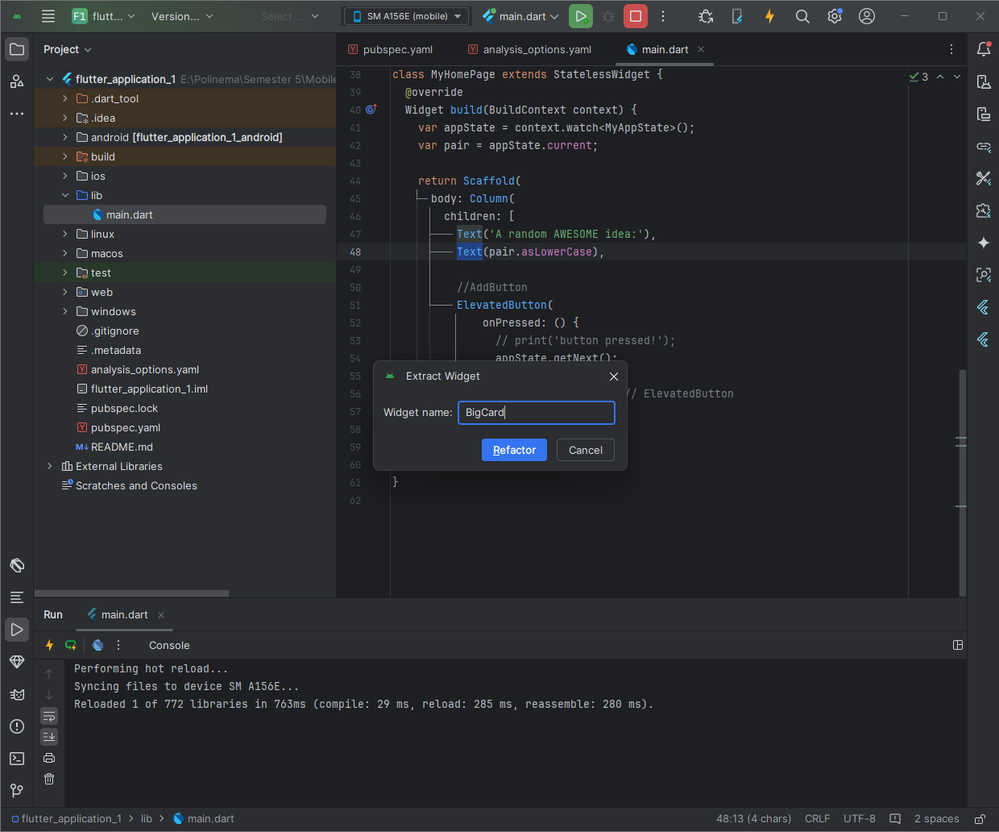

>Nama : Icha Dewi Putriana
Nim : 2241720069
TI - 3F
Link Github : https://github.com/ichaputri/flutter_application_1

# Laporan Tugas Pertemuan 5
Flutter adalah toolkit UI Google untuk membangun aplikasi untuk perangkat seluler, web, dan desktop dari codebase tunggal. Dalam codelab ini, Anda akan membangun aplikasi Flutter berikut:

Aplikasi ini menghasilkan nama yang terkesan keren, seperti "newstay", "lightstream", "mainbrake", atau "graypine". Pengguna dapat meminta nama berikutnya, memfavoritkan nama saat ini, dan meninjau daftar nama yang difavoritkan di halaman terpisah. Aplikasi ini responsif terhadap berbagai ukuran layar.

---

### Membuat Proyek Flutter pertama anda

- Luncurkan Visual Studio Code dan buka palet perintah (dengan `F1` atau `Ctrl+Shift+P` atau `Shift+Cmd+P`). Ketik "flutter new". Pilih perintah `Flutter: New Project.`

- Berikutnya, pilih Application lalu folder tempat proyek akan dibuat. Folder ini dapat berupa direktori utama Anda, atau direktori seperti `C:\src\.`

- Terakhir, beri nama proyek Anda. 

### Menyalin & Menempelkan aplikasi awal
buka file `pubspec.yaml.`

Berikutnya, buka file konfigurasi lainnya dalam proyek tersebut, analysis_options.yaml.

Terakhir, buka file main.dart pada direktori `lib/.`

### Menambahkan Tombol
- Pertama, buka `lib/main.dart` dan pastikan Anda memilih perangkat target. Di bagian pojok kanan bawah VS Code, Anda akan menemukan tombol yang menampilkan perangkat target saat ini. Klik tombol untuk mengubahnya.
- Selagi `lib/main.dart` terbuka, temukan tombol "play" di pojok kanan atas jendela VS Code lalu klik tombol tersebut.
- Setelah beberapa saat, aplikasi Anda diluncurkan dalam mode debug. Tampilannya masih terlihat biasa saja:

>Catatan: Jika target pengembangan Anda adalah perangkat seluler, kemungkinan sebagian teks terhalang oleh notch atau status bar. Anda akan segera mempelajari cara memperbaiki ini.

### Hot Reload Pertama
Di bagian bawah `lib/main.dart`, tambahkan sesuatu pada string di objek Text pertama, dan simpan file tersebut (dengan `Ctrl+S` atau `Cmd+S`). Misalnya:

Berikutnya, tambahkan tombol di bagian bawah `Column`, tepat di bawah instance `Text` kedua.

Meskipun menyenangkan melihat Konsol Debug, Anda ingin tombol tersebut melakukan sesuatu yang lebih berguna. Namun, sebelum mencapai ke sana, perhatikan kode pada lib/main.dart lebih dekat, untuk memahami cara kerjanya.

## Memperindah Tampilan Aplikasi
---

### Mengekstrak Widget

Pada menu Refactor, pilih Extract Widget. Tetapkan nama, seperti BigCard, lalu klik Enter.

Tindakan ini secara otomatis membuat class baru, BigCard, di akhir file saat ini. Class tersebut akan terlihat seperti berikut:

### Menambahkan Kartu

Temukan class `BigCard` dan metode `build()` yang berada di dalamnya. Sama seperti sebelumnya, panggil menu `Refactor` pada widget `Text`. Namun, kali ini Anda tidak akan mengekstrak widget.

Sebagai gantinya, pilih `Wrap with Padding`. Tindakan ini menciptakan widget induk baru di sekitar widget `Text` bernama `Padding`. Setelah menyimpannya, Anda akan melihat bahwa kata acak tersebut telah memiliki ruang yang lebih luas.

Tingkatkan padding dari nilai default 8.0. Misalnya, gunakan 20 untuk padding yang lebih luas.

Berikutnya, mari kita naik satu tingkat lebih tinggi. Tempatkan kursor Anda pada widget Padding, buka menu Refactor, lalu pilih Wrap with widget....

Tindakan ini memungkinkan Anda untuk menentukan widget induk. Ketik "Card" dan tekan Enter.

>hasil

### Tema dan Gaya
Untuk membuat kartu menjadi lebih menarik, beri warna yang lebih kaya pada kartu tersebut. Karena ada baiknya untuk menjaga skema warna yang konsisten, gunakan `Theme` aplikasi untuk memilih warna.

Buat perubahan berikut untuk metode `build()` `BigCard`.

>saya ganti menggunakam warna ungu

### TextTheme
Kartu tersebut masih memiliki masalah: ukuran teks terlalu kecil dan warnanya membuat teks sulit dibaca. Untuk memperbaiki masalah ini, buat perubahan berikut pada metode `build()` `BigCard`.

### Meningkatkan aksesibilitas
Mengganti `pair.asLowerCase` dengan `${pair.first} ${pair.second}` pada properti semanticsLabel di Text widget. Ini memperbaiki pelafalan oleh pembaca layar tanpa mengubah tampilan visual.

### Menempatkan UI Ditengah
Tempatkan UI di tengah dengan mengubah properti `mainAxisAlignment` dari Column di `BigCard` menjadi `MainAxisAlignment.center`.

Anda dapat menempatkan kolom itu sendiri di tengah. Letakkan kursor Anda di Column, buka menu Refactor (dengan Ctrl+. atau Cmd+.), lalu pilih Wrap with Center.

## Menambahkan Fungsi
---
Aplikasi berjalan dengan baik, dan bahkan terkadang menyediakan pasangan kata yang menarik. Namun, setiap kali pengguna mengklik Next, setiap pasangan kata hilang selamanya. Akan lebih baik untuk memiliki cara "mengingat" saran terbaik: seperti tombol 'Like'.

### Menambahkan Logika Bisnis
Scroll ke MyAppState dan tambahkan kode berikut:

menambahkan properti favorites pada MyAppState, diinisialisasi sebagai daftar kosong <WordPair>[]. Properti ini memastikan hanya WordPair yang bisa masuk ke dalam daftar. Metode toggleFavorite() ditambahkan untuk menambah atau menghapus pasangan kata dari daftar favorit, kemudian memanggil notifyListeners() untuk memperbarui UI. Meskipun bisa menggunakan Set, daftar dipilih untuk kesederhanaan.

### Menambahkan Tombol

Gabungkan tombol dalam Row di metode build() MyHomePage dengan membungkus tombol menggunakan Row. Gunakan mainAxisSize: MainAxisSize.min agar Row tidak mengambil seluruh ruang horizontal, mirip seperti bagaimana mainAxisAlignment digunakan di Column.

Berikutnya, menambahkan tombol Like dan hubungkan ke toggleFavorite().

## Menambahkan Kolom Samping Navigasi
---
Sebagian besar aplikasi tidak dapat memuat semuanya ke dalam satu layar. Aplikasi ini mungkin dapat melakukannya, tetapi untuk tujuan pembelajaran, kita akan membuat layar terpisah untuk bagian favorit pengguna. Untuk beralih di antara dua layar, kita akan menerapkan StatefulWidget pertama kita.

Untuk mencapai inti dari langkah ini secepat mungkin, pisahkan MyHomePage menjadi 2 widget terpisah.

Ubah `MyHomePage` menjadi `StatefulWidget` agar dapat menyimpan status lokal seperti `selectedIndex`. Gunakan IDE untuk refactor dan buat class baru `_MyHomePageState`. Class ini mengelola status internal dan bisa mengubah dirinya sendiri, sementara metode `build()` dipindahkan ke dalamnya tanpa mengubah fungsionalitas.

### SetsState
Widget stateful baru hanya perlu melacak satu variabel: `selectedIndex`.

### Menggunakan selectedIndex

Tempatkan kode berikut di bagian atas metode build `_MyHomePageState`, tepat sebelum `return Scaffold`:

Kini, setelah page berisi widget yang ingin Anda tampilkan di sebelah kanan, Anda mungkin dapat menebak perubahan apa lagi yang diperlukan.

Berikut tampilan _MyHomePageState setelah satu perubahan tersebut:

### Tingkat respons
Berikutnya, buat kolom samping navigasi menjadi responsif. Dengan kata lain, buat agar kolom samping navigasi menampilkan label secara otomatis (menggunakan `extended: true`) saat ada ruang yang cukup.

## Menambahkan halaman baru
---
Menambahkan halaman baru untuk placeholder halaman favorites yang sudah kita tambahkan tadi.

