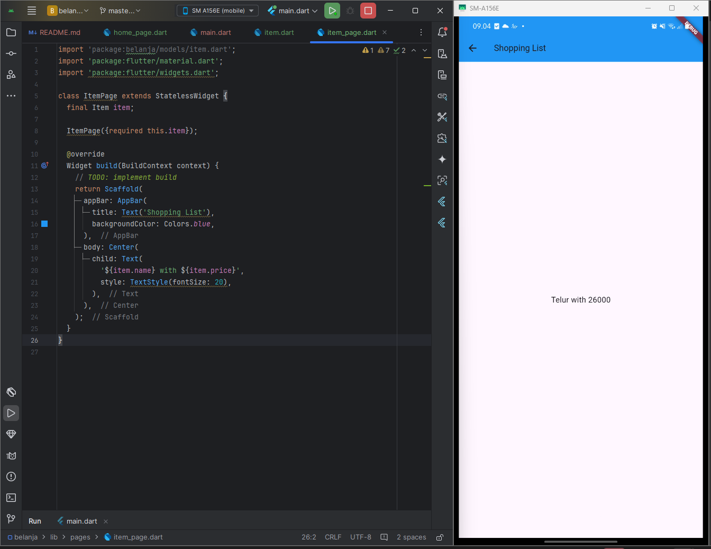

# Pertemuan 6 - Layout dan Navigasi
Pada codelab ini, Anda akan mempelajari konsep dan praktik untuk dasar-dasar framework Flutter dengan menerapkan layout dan navigasi.

---

## Praktikum 1 : Membangun Layout di Flutter

---

### Langkah 1 : Buat Project Baru
Buatlah sebuah project flutter baru dengan nama layout_flutter. Atau sesuaikan style laporan praktikum yang Anda buat.

### Langkah 2 : Buka file lib/main.dart
Buka file `main.dart` lalu ganti dengan kode berikut. Isi nama dan NIM Anda di `text title.`

### Langkah 3 : Identifikasi Layout Diagram
Pertama, identifikasi elemen yang lebih besar. Dalam contoh ini, empat elemen disusun menjadi sebuah kolom: sebuah gambar, dua baris, dan satu blok teks.

Selanjutnya, buat diagram setiap baris. Baris pertama, disebut bagian Judul, memiliki 3 anak: kolom teks, ikon bintang, dan angka. Anak pertamanya, kolom, berisi 2 baris teks. Kolom pertama itu memakan banyak ruang, sehingga harus dibungkus dengan widget yang Diperluas.

### Langkah 4 : Implementasi tittle row
Pertama, Anda akan membuat kolom bagian kiri pada judul. Tambahkan kode berikut di bagian atas metode build() di dalam kelas MyApp:

- **Soal 1** Letakkan widget Column di dalam widget Expanded agar menyesuaikan ruang yang tersisa di dalam widget Row. Tambahkan properti crossAxisAlignment ke CrossAxisAlignment.start sehingga posisi kolom berada di awal baris.

- **soal 2** Letakkan baris pertama teks di dalam Container sehingga memungkinkan Anda untuk menambahkan padding = 8. Teks 'Batu, Malang, Indonesia' di dalam Column, set warna menjadi abu-abu.

- **soal 3** Dua item terakhir di baris judul adalah ikon bintang, set dengan warna merah, dan teks "41". Seluruh baris ada di dalam Container dan beri padding di sepanjang setiap tepinya sebesar 32 piksel. Kemudian ganti isi body text 'Hello World' dengan variabel titleSection seperti berikut:

## Praktikum 2 - Implementasi button row
---

### Langkah 1 : Buat method Column _buildButtonColumn

Buat metode pembantu pribadi bernama buildButtonColumn(), yang mempunyai parameter warna, Icon dan Text, sehingga dapat mengembalikan kolom dengan widgetnya sesuai dengan warna tertentu.

### Langkah 2 : Buat widget buttonSection
Buat Fungsi untuk menambahkan ikon langsung ke kolom. Teks berada di dalam Container dengan margin hanya di bagian atas, yang memisahkan teks dari ikon.

### Langkah 3 : Tambah button section ke body
Tambahkan variabel buttonSection ke dalam body seperti berikut:

## Praktikum 3 - Implementasi button row
---

### Langkah 1 : Buat widget textSection

Tentukan bagian teks sebagai variabel. Masukkan teks ke dalam Container dan tambahkan padding di sepanjang setiap tepinya. Tambahkan kode berikut tepat di bawah deklarasi buttonSection:

Dengan memberi nilai softWrap = true, baris teks akan memenuhi lebar kolom sebelum membungkusnya pada batas kata.

### Langkah 2 : Tambahkan variabel text section ke body
Tambahkan widget variabel textSection ke dalam body seperti berikut:

## Praktikum 4 - Implementasi image section
---

### Langkah 1 : Siapkan aset gambar

Anda dapat mencari gambar di internet yang ingin ditampilkan. Buatlah folder images di root project layout_flutter. Masukkan file gambar tersebut ke folder images, lalu set nama file tersebut ke file pubspec.yaml seperti berikut:

### Langkah 2 : Tambahkan gambar ke body
Tambahkan aset gambar ke dalam body seperti berikut:

BoxFit.cover memberi tahu kerangka kerja bahwa gambar harus sekecil mungkin tetapi menutupi seluruh kotak rendernya.

### Langkah 3 : Terakhir, ubah menjadi ListView
Pada langkah terakhir ini, atur semua elemen dalam ListView, bukan Column, karena ListView mendukung scroll yang dinamis saat aplikasi dijalankan pada perangkat yang resolusinya lebih kecil.

## Praktikum 5 - Implementasi button row
---

### Langkah 1 : Siapkan project baru

Sebelum melanjutkan praktikum, buatlah sebuah project baru Flutter dengan nama belanja dan susunan folder seperti pada gambar berikut. Penyusunan ini dimaksudkan untuk mengorganisasi kode dan widget yang lebih mudah.

### Langkah 2 : Mendefinisikan Route
Buatlah dua buah file dart dengan nama home_page.dart dan item_page.dart pada folder pages. Untuk masing-masing file, deklarasikan class HomePage pada file home_page.dart dan ItemPage pada item_page.dart. Turunkan class dari StatelessWidget. Gambaran potongan kode dapat anda lihat sebagai berikut.

### Langkah 3 : Lengkapi Kode di main.dart
Pada langkah ini anda akan mendefinisikan Route untuk kedua halaman tersebut. Definisi penamaan route harus bersifat unique. Halaman HomePage didefinisikan sebagai /. Dan halaman ItemPage didefinisikan sebagai /item. Untuk mendefinisikan halaman awal, anda dapat menggunakan named argument initialRoute. Gambaran tahapan ini, dapat anda lihat pada potongan kode berikut.

### Langkah 4 : Membuat data model
Sebelum melakukan perpindahan halaman dari HomePage ke ItemPage, dibutuhkan proses pemodelan data. Pada desain mockup, dibutuhkan dua informasi yaitu nama dan harga. Untuk menangani hal ini, buatlah sebuah file dengan nama item.dart dan letakkan pada folder models. Pada file ini didefinisikan pemodelan data yang dibutuhkan. Ilustrasi kode yang dibutuhkan, dapat anda lihat pada potongan kode berikut.

### Langkah 5 : Lengkapi kode di class HomePage
Pada halaman HomePage terdapat ListView widget. Sumber data ListView diambil dari model List dari object Item. Gambaran kode yang dibutuhkan untuk melakukan definisi model dapat anda lihat sebagai berikut.

### Langkah 6 : Membuat ListView dan itemBuilder
Untuk menampilkan ListView pada praktikum ini digunakan itemBuilder. Data diambil dari definisi model yang telah dibuat sebelumnya. Untuk menunjukkan batas data satu dan berikutnya digunakan widget Card. Kode yang telah umum pada bagian ini tidak ditampilkan. Gambaran kode yang dibutuhkan dapat anda lihat sebagai berikut.

### Langkah 7 : Menambahkan aksi pada ListView
Untuk menambahkan aksi pada `ListView`, gunakan widget `InkWell`, yang memberikan efek saat ditekan. Pertama, tempatkan kursor pada widget pembuka `Card`, lalu gunakan shortcut quick fix di VSCode (Ctrl + . pada Windows atau Cmd + . pada MacOS). Sorot menu "wrap with widget..." dan ubah nilai widget menjadi `InkWell`. Setelah itu, tambahkan argumen bernama `onTap` yang berisi fungsi untuk berpindah ke halaman `ItemPage`. Dengan langkah-langkah ini, interaksi pada item di `ListView` dapat diimplementasikan dengan baik.

