# **Layout a Widget**
Inti dari mekanisme tata letak Flutter adalah widget. Di Flutter, hampir semuanya adalah widget—bahkan model tata letak adalah widget. Gambar, ikon, dan teks yang Anda lihat di aplikasi Flutter semuanya adalah widget. Tetapi hal-hal yang tidak Anda lihat juga merupakan widget, seperti baris, kolom, dan kisi yang mengatur, membatasi, dan menyelaraskan widget yang terlihat.
## 1. pilih tata letak widget 
---
Pilih dari berbagai widget tata letak berdasarkan bagaimana Anda ingin menyelaraskan atau membatasi widget yang terlihat, karena karakteristik ini biasanya diteruskan ke widget yang terkandung.

## 2. Buat widget yang terlihat
---
- Buat widget teks
- Buat widget gambar
- Buat widget ikon

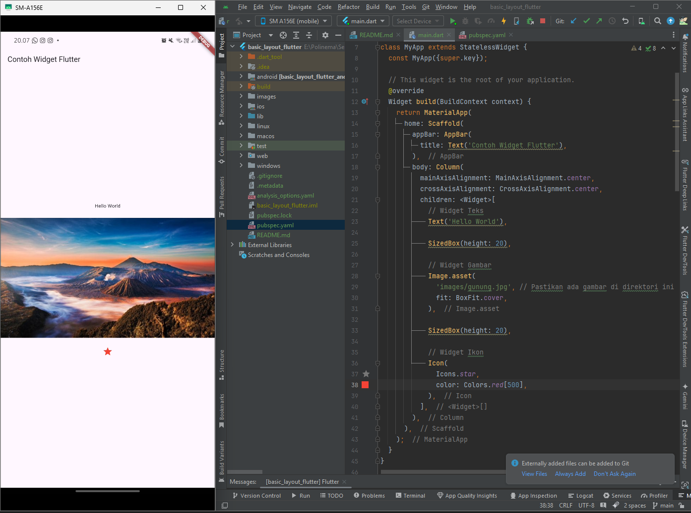

## 3. Tambahkan widget yang terlihat ke widget tata letak
---
Semua widget tata letak memiliki salah satu dari berikut ini:

- Properti jika mereka mengambil satu anak—misalnya, atau childCenterContainer
- Sebuah properti jika mereka mengambil daftar widget—misalnya, , , , atau .childrenRowColumnListViewStack

Tambahkan widget ke widget:TextCenter

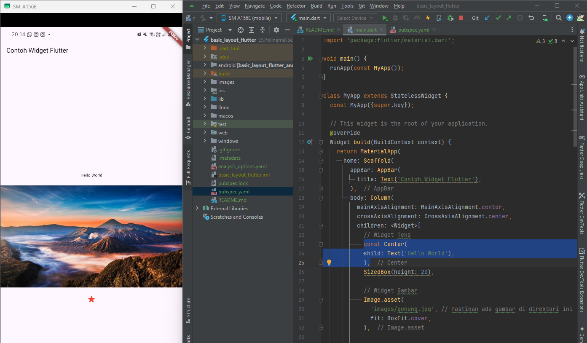

## 4. Tambahkan widget tata letak ke halaman
Aplikasi Flutter itu sendiri adalah widget, dan sebagian besar widget memiliki metode build(). Membuat instance dan mengembalikan widget dalam metode aplikasi akan menampilkan widget.build()

---

### Aplikasi Material

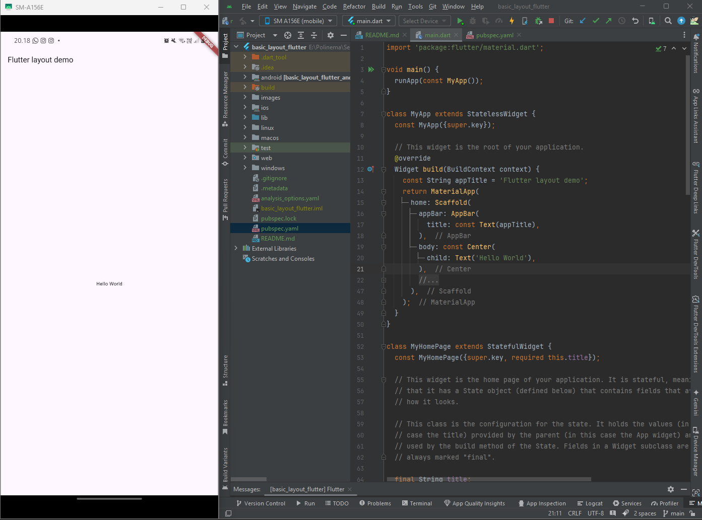

### Aplikasi Cupertino

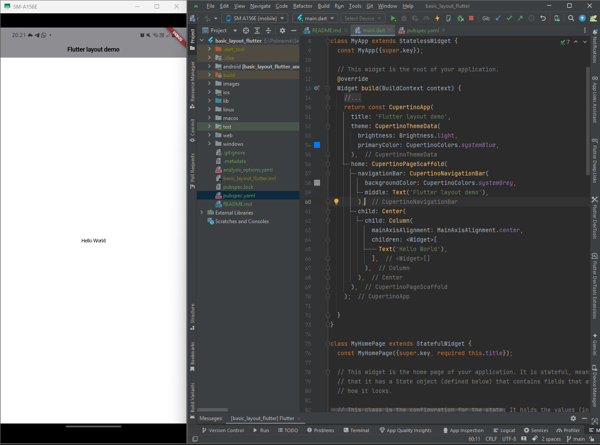

### Aplikasi non-material

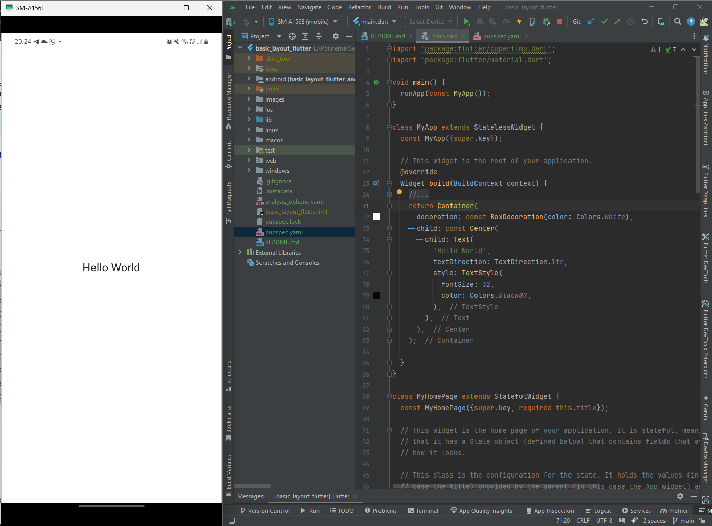

## Tata letak beberapa widget secara vertikal dan horizontal

---

Salah satu pola tata letak yang paling umum adalah mengatur widget secara vertikal atau horizontal. Anda dapat menggunakan widget untuk mengatur widget secara horizontal, dan widget untuk mengatur widget secara vertikal.RowColumn

### Menyelaraskan Widget

---

Menggunakan Row

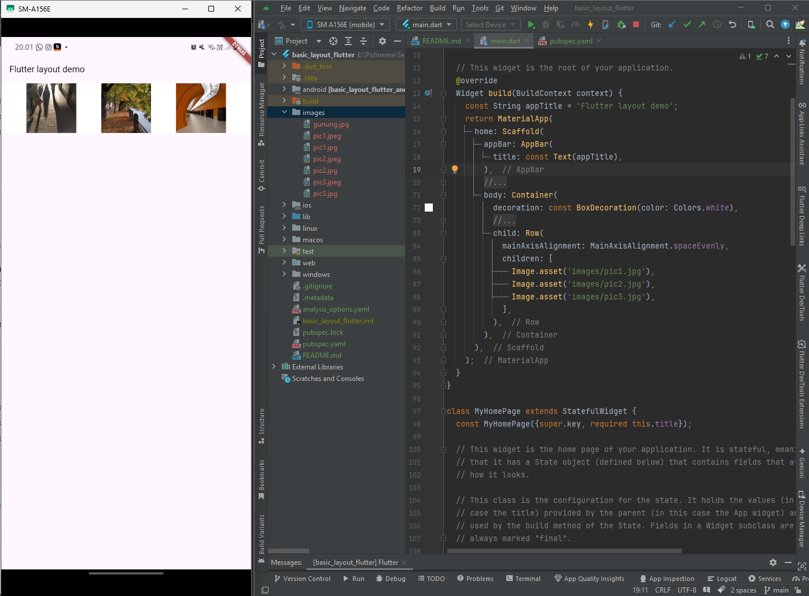

Menggunakan Column

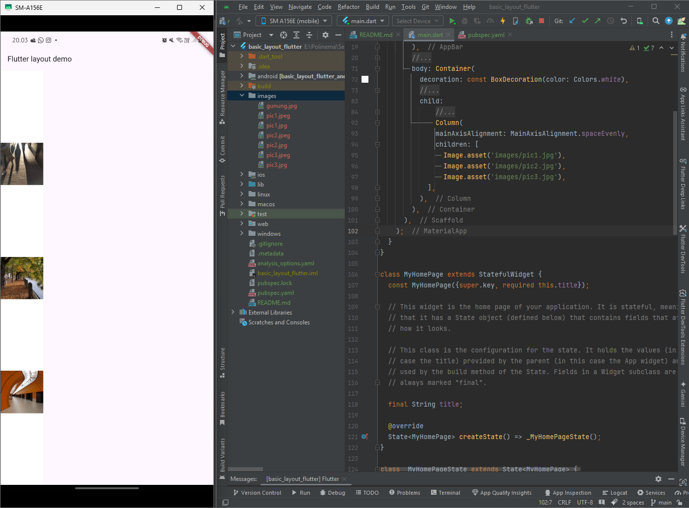

### Widget Ukuran
---

Widget dapat disesuaikan dengan ukuran agar sesuai dengan baris atau kolom dengan menggunakan widget yang diperluas. Untuk memperbaiki contoh sebelumnya di mana baris gambar terlalu lebar untuk kotak rendernya, bungkus setiap gambar dengan `widget.Expanded`

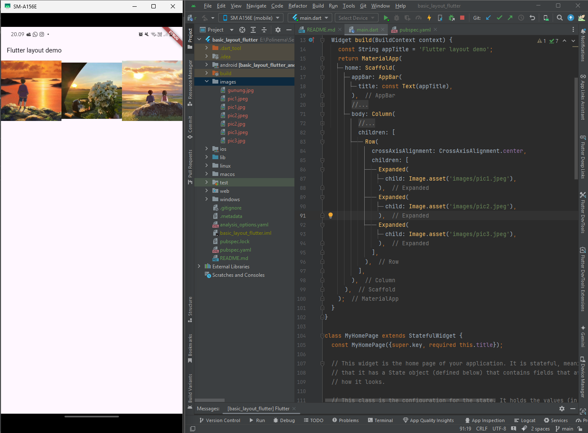

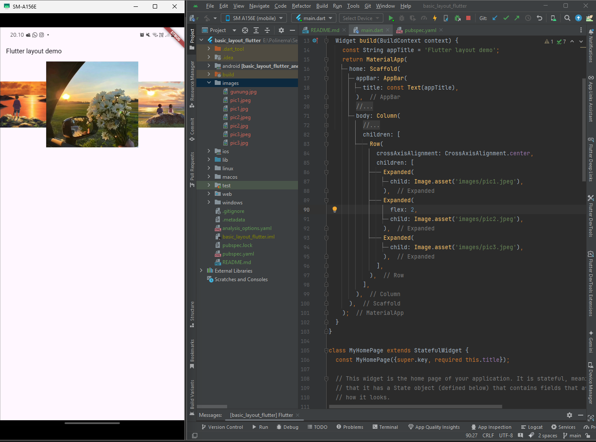

### Widget pengepakan

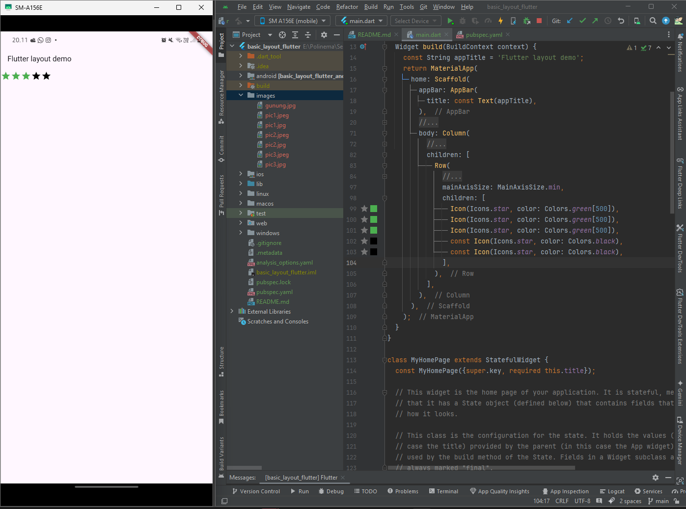

### Bertumpuk baris dan kolom

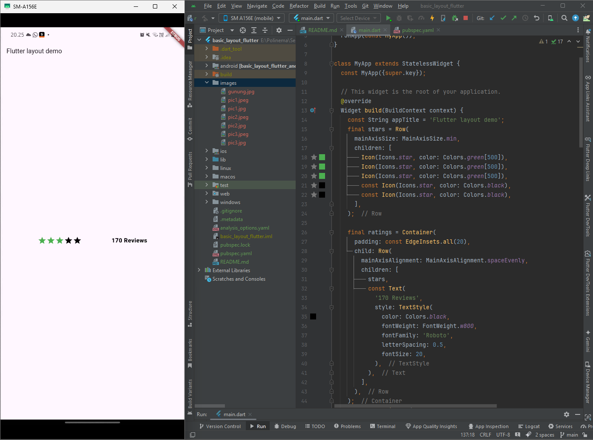

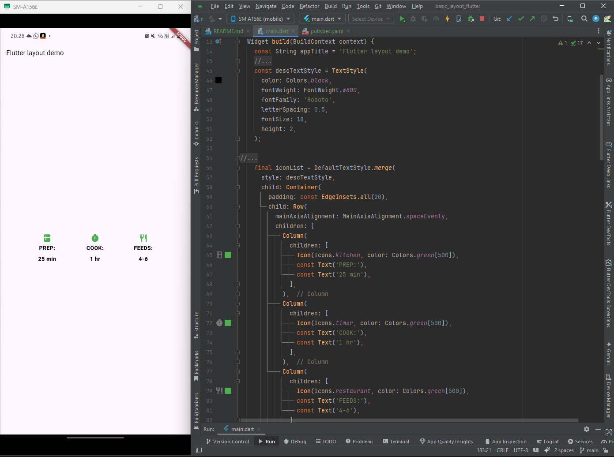

Variabel berisi baris peringkat dan ikon, serta judul dan teks yang menggambarkan Brownies:leftColumn

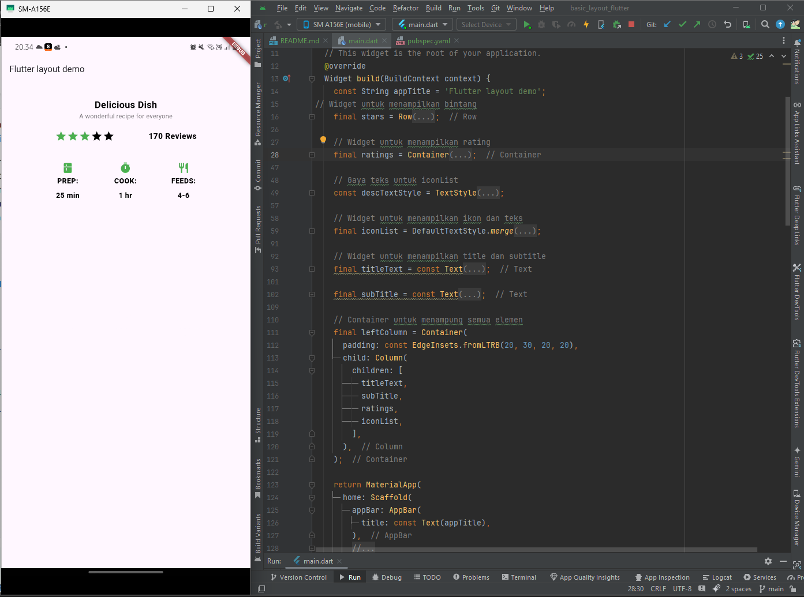

Kolom kiri ditempatkan di a untuk membatasi lebarnya. Terakhir, UI dibuat dengan seluruh baris (berisi kolom kiri dan gambar) di dalam .SizedBoxCard

