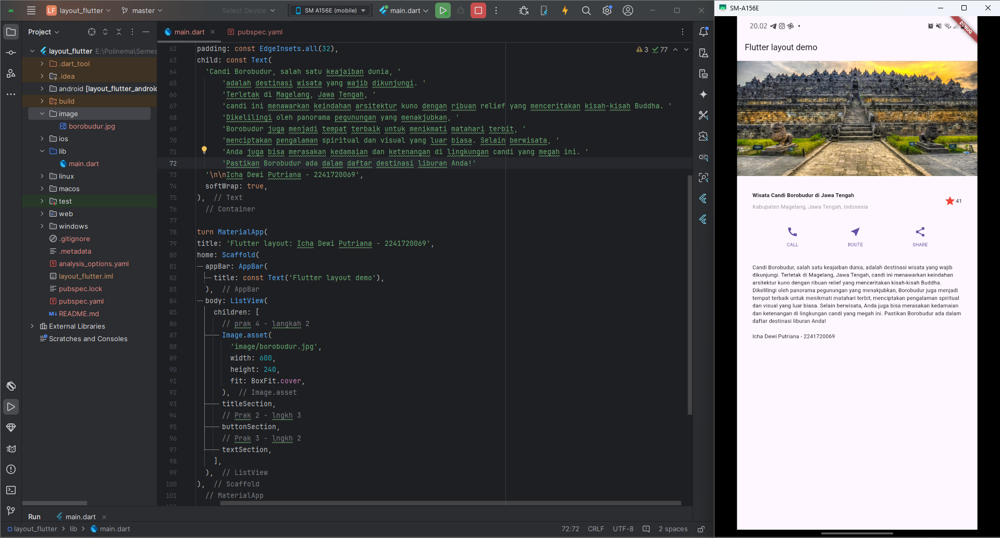
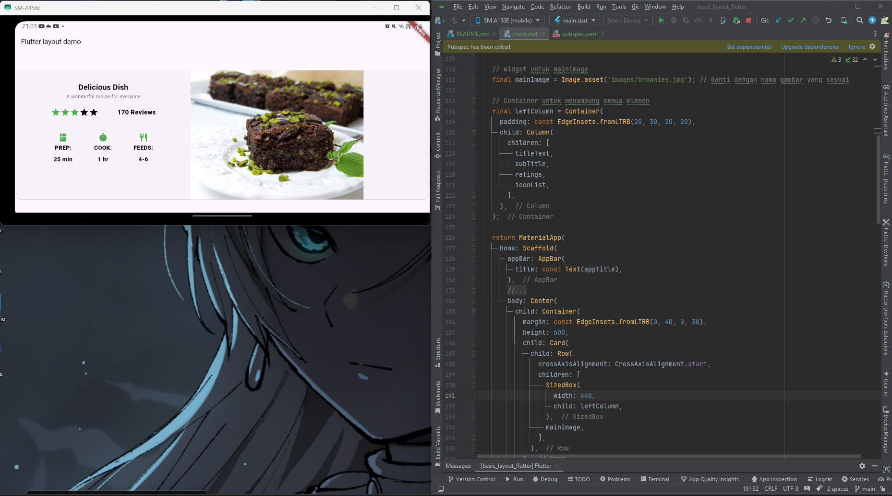
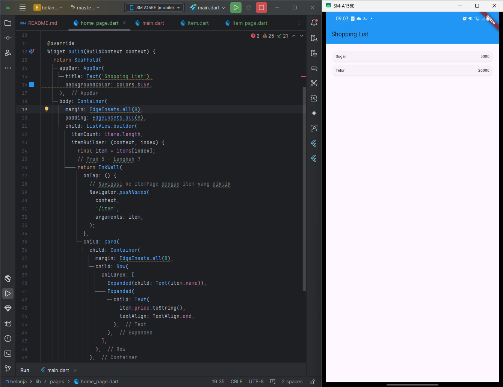
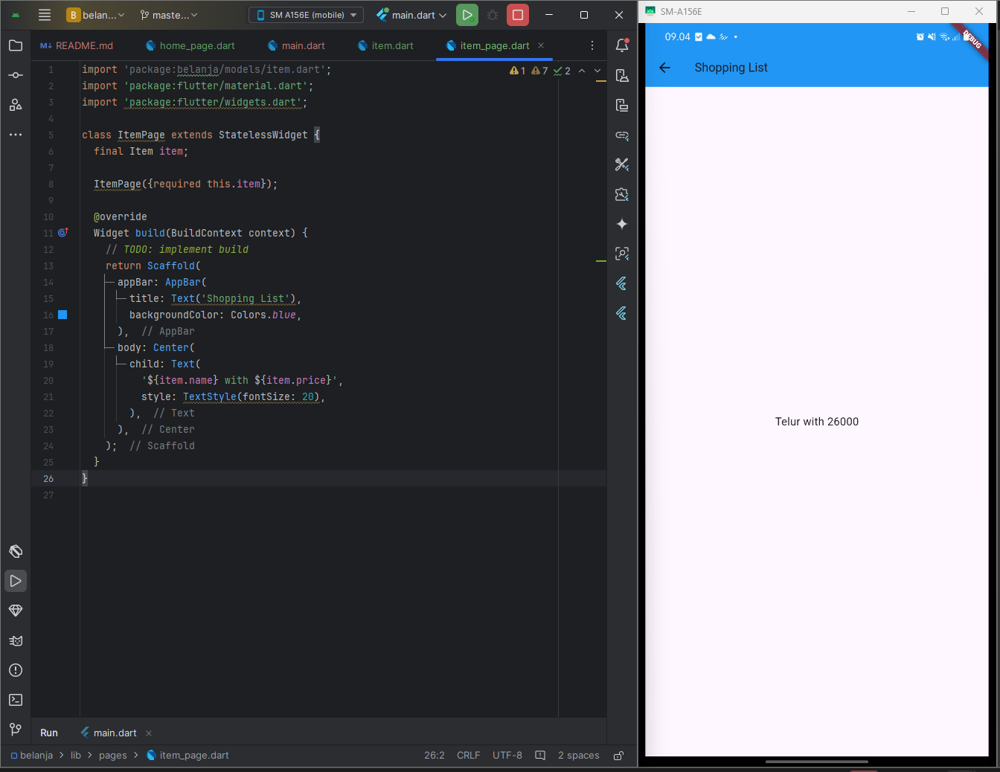
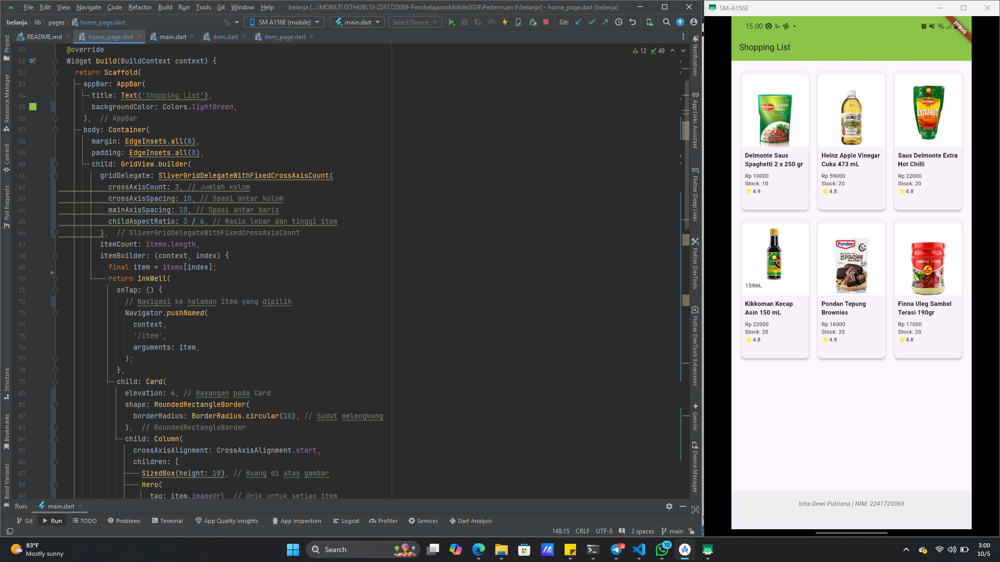
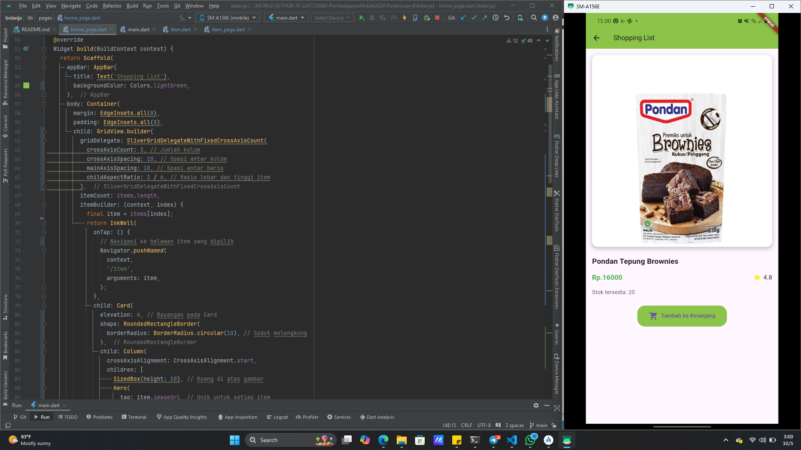

## Data Diri

|  |  |
|--|--|
| NIM | 2241720069 |
| Nama Lengkap | Icha Dewi Putriana |
| Kelas | TI-3F |

## Pertemuan 6
---

### Layout_flutter

Untuk laporan yang lebih lengkap bisa dilihat di link berikut ini : [Laporan Praktikum (Lihat yang Praktikum 1 - 4 untuk project ini)](https://github.com/ichaputri/10-2241720069-PembelajaranMobile2024/blob/c8f714724e3b9419dd73f94a21531b8175748647/Pertemuan%205/LaporanTugas.md)

Hasil Akhir Project 

---

### basic_layout_flutter
Untuk laporan praktikum lebih lengkapnya bisa dilihat di link berikut : 
[Laporan Tugas Praktikum - 1](https://github.com/ichaputri/10-2241720069-PembelajaranMobile2024/blob/fe5ab083d361220b8a2437fe6dceb906050e92de/Pertemuan%206/LaporanTugas1.md)

Hasil Praktikum

---

### belanja
Untuk laporan praktikum lebih lengkapnya bisa dilihat di link berikut : 
[Laporan Praktikum (Lihat yang Praktikum 5 untuk project ini)](https://github.com/ichaputri/10-2241720069-PembelajaranMobile2024/blob/c8f714724e3b9419dd73f94a21531b8175748647/Pertemuan%205/LaporanTugas.md)

Hasil Praktikum

**Hasil Tugas Praktikum 2**
Untuk laporan tugas lebih lengkapnya bisa dilihat di link berikut : 
[Laporan Tugas Praktikum - 2](https://github.com/ichaputri/10-2241720069-PembelajaranMobile2024/blob/fe5ab083d361220b8a2437fe6dceb906050e92de/Pertemuan%206/LaporanTugas2.md)

