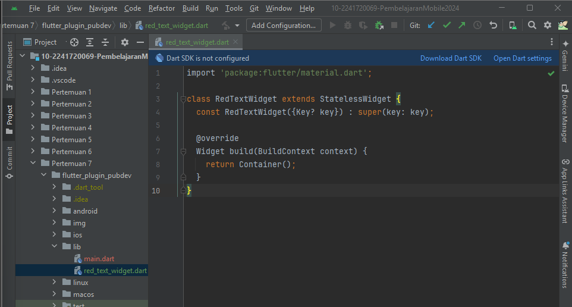

# JOBSHEET 7: Praktikum Menerapkan Plugin di Project Flutter
---

## Langkah 1: Buat Project Baru
Buatlah sebuah project flutter baru dengan nama flutter_plugin_pubdev. Lalu jadikan repository di GitHub Anda dengan nama flutter_plugin_pubdev.

## Langkah 2: Menambahkan Plugin
Tambahkan plugin auto_size_text menggunakan perintah berikut di terminal

## Langkah 3: Buat file red_text_widget.dart
Buat file baru bernama `red_text_widget.dart` di dalam folder lib lalu isi kode seperti berikut.

## Langkah 4: Tambah Widget AutoSizeText
Masih di file red_text_widget.dart, untuk menggunakan plugin `auto_size_text`, ubahlah kode return `Container()` menjadi seperti berikut.

Terjadi eror, karena 
- `RedTextWidget` belum mengimport  `AutoSizeText`. Tambahkan dahulu untuk import `AutoSizeText` nya. 

- untuk error di `text` karena belum diinisialisasi 

contoh kode yang sudah benar

## Langkah 5: Buat Variabel text dan parameter di constructor
Tambahkan variabel text dan parameter di constructor seperti berikut.

## Langkah 6: Tambahkan widget di main.dart
Buka file main.dart lalu tambahkan di dalam children: pada class `_MyHomePageState`

# Tugas Praktikum
---
1. Selesaikan Praktikum tersebut, lalu dokumentasikan dan push ke repository Anda berupa screenshot hasil pekerjaan beserta penjelasannya di file README.md!
2. Jelaskan maksud dari langkah 2 pada praktikum tersebut!
    **Jawab :**
    > Langkah 2 pada praktikum tersebut menjelaskan bagaimana cara menambahkan plugin `auto_size_text` ke dalam proyek Flutter. Plugin ini digunakan untuk menampilkan teks yang dapat secara otomatis menyesuaikan ukurannya agar sesuai dengan batasan ruang yang tersedia, seperti dalam kasus di mana teks mungkin terlalu panjang untuk ditampilkan dalam satu baris.
1. Jelaskan maksud dari langkah 5 pada praktikum tersebut!
    **Jawab :** 
    > Langkah 5 menambahkan variabel text dan parameter pada constructor agar widget `RedTextWidget` bisa menerima teks secara dinamis saat dipanggil.
    > - `final String text;` mendefinisikan variabel untuk menyimpan teks.
    > - `required this.text` pada constructor memastikan teks harus diberikan saat membuat widget.
Ini memungkinkan teks yang ditampilkan bisa diatur dari luar widget.
1. Pada langkah 6 terdapat dua widget yang ditambahkan, jelaskan fungsi dan perbedaannya!
    **Jawab :**
    > Pada langkah 6, dua widget ditambahkan:
    > - Container dengan `RedTextWidget`: Menampilkan teks berwarna merah dengan ukuran otomatis menyesuaikan ruang.
    > - Container dengan `Text`: Menampilkan teks standar tanpa modifikasi khusus.
    >
    > Perbedaannya, `RedTextWidget` memodifikasi tampilan teks, sedangkan `Text` menampilkan teks secara default.
1. Jelaskan maksud dari tiap parameter yang ada di dalam plugin `auto_size_text` berdasarkan tautan pada dokumentasi ini !
**Jawab :**
    > Berdasarkan dokumentasi, parameter pada plugin `auto_size_text` adalah sebagai berikut:
    > - **usage**: Menunjukkan penggunaan dasar dari widget AutoSizeText yang berfungsi seperti Text tetapi dapat mengubah ukuran teks agar sesuai dengan batasnya.
    > - **maxLines**: Menentukan jumlah maksimum baris teks yang dapat ditampilkan. Jika tidak ditentukan, teks akan disesuaikan dengan lebar dan tinggi yang tersedia.
    > - **minFontSize & maxFontSize**: Menentukan ukuran font terkecil dan terbesar yang diizinkan. minFontSize berguna untuk memastikan teks tidak terlalu kecil, sedangkan maxFontSize membatasi ukuran font terbesar.
    > - **group**: Digunakan untuk menyinkronkan ukuran font dari beberapa AutoSizeText. Semua AutoSizeText dalam grup yang sama akan memiliki ukuran font yang sama, menyesuaikan dengan anggota grup dengan ukuran font efektif terkecil.
    > - **stepGranularity**: Menentukan seberapa banyak ukuran font dikurangi setiap langkah. Nilai ini biasanya tidak boleh di bawah 1 untuk kinerja terbaik.
    > - **presetFontSizes**: Jika diatur, hanya ukuran font yang ditentukan dalam daftar ini yang akan digunakan, mengabaikan minFontSize, maxFontSize, dan stepGranularity1.
    > - **overflowReplacement**: Widget ini ditampilkan jika teks meluap dan tidak sesuai dengan batasnya. Ini berguna untuk mencegah teks menjadi terlalu kecil untuk dibaca.
    > - **richText**: Anda dapat menggunakan teks kaya (seperti gaya teks berbeda atau tautan) dengan AutoSizeText menggunakan konstruktor AutoSizeText.rich()
1. Kumpulkan laporan praktikum Anda berupa link repository GitHub kepada dosen!