<table>
    <thead>
        <th style="text-align: center;" colspan="2">Pertemuan 9</th>
    </thead>
    <tbody>
        <tr>
            <td>Nama</td>
            <td>Icha Dewi Putriana</td>
        </tr>
        <tr>
            <td>Nim</td>
            <td>2241720069</td>
        </tr>
    </tbody>
</table>

**********
# *Jobsheet 09 - Kamera di Flutter*
***********

## Praktikum 1 - Mengambil Foto dengan Kamera di Flutter

-----

#### Langkah 1 - Buat Project Baru
Buatlah sebuah project flutter baru dengan nama kamera_flutter, lalu sesuaikan style laporan praktikum yang Anda buat.


#### Langkah 2: Tambah dependensi yang diperlukan
Anda memerlukan tiga dependensi pada project flutter untuk menyelesaikan praktikum ini.

- `camera` → menyediakan seperangkat alat untuk bekerja dengan kamera pada device.
- `path_provider` → menyediakan lokasi atau path untuk menyimpan hasil foto.
- `path` → membuat path untuk mendukung berbagai platform.

Untuk menambahkan dependensi plugin, jalankan perintah flutter pub add seperti berikut di terminal:

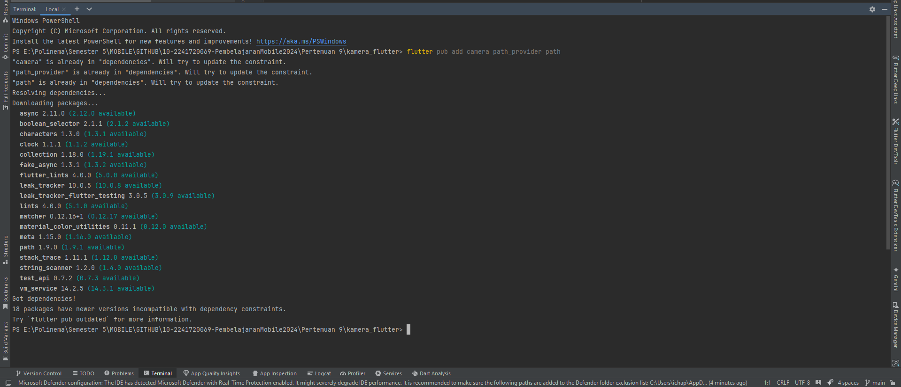

Pada iOS, baris kode berikut harus ditambahkan pada file ios/Runner/Info.plist untuk mengakses kamera dan microphone.

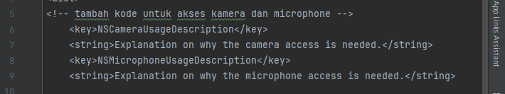

#### Langkah 3: Ambil Sensor Kamera dari device
Selanjutnya, kita perlu mengecek jumlah kamera yang tersedia pada perangkat menggunakan plugin camera seperti pada kode berikut ini. Kode ini letakkan dalam void main().

**lib/main.dart**

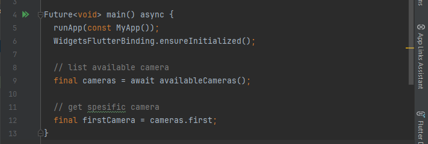

Ubah void main() menjadi async function seperti berikut ini.
**lib/main.dart**

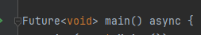


Pastikan melakukan impor plugin sesuai yang dibutuhkan.

#### Langkah 4: Buat dan inisialisasi CameraController
Setelah Anda dapat mengakses kamera, gunakan langkah-langkah berikut untuk membuat dan menginisialisasi CameraController. Pada langkah berikut ini, Anda akan membuat koneksi ke kamera perangkat yang memungkinkan Anda untuk mengontrol kamera dan menampilkan pratinjau umpan kamera.

1. Buat `StatefulWidget` dengan kelas `State` pendamping.
2. Tambahkan variabel ke kelas `State` untuk menyimpan `CameraController`.
3. Tambahkan variabel ke kelas `State` untuk menyimpan `Future` yang dikembalikan dari `CameraController.initialize().`
4. Buat dan inisialisasi controller dalam metode `initState()`.
5. Hapus controller dalam metode `dispose().`

**lib/widget/takepicture_screen.dart**

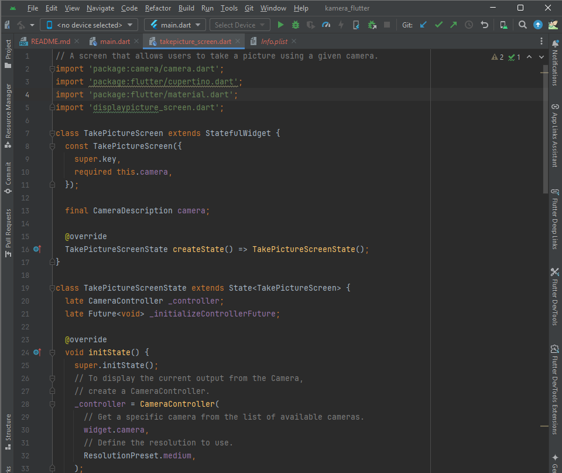

>*Perhatian:* Jika Anda tidak menginisialisasi `CameraController`, Anda tidak dapat menggunakan kamera untuk menampilkan pratinjau dan mengambil gambar.

#### Langkah 5 - Gunakan CameraPreview untuk menampilkan preview foto
Gunakan widget CameraPreview dari package camera untuk menampilkan preview foto. Anda perlu tipe objek void berupa FutureBuilder untuk menangani proses async.

> *Perhatian:* Pada kode ini Anda perlu logic untuk menunggu controller selesai proses inisialisasi sebelum bekerja dengan kamera. Anda harus menunggu hasil dari method _initializeControllerFuture(), yang telah dibuat sebelumnya, agar dapat menampilkan preview foto dengan CameraPreview.

**lib/widget/takepicture_screen.dart**

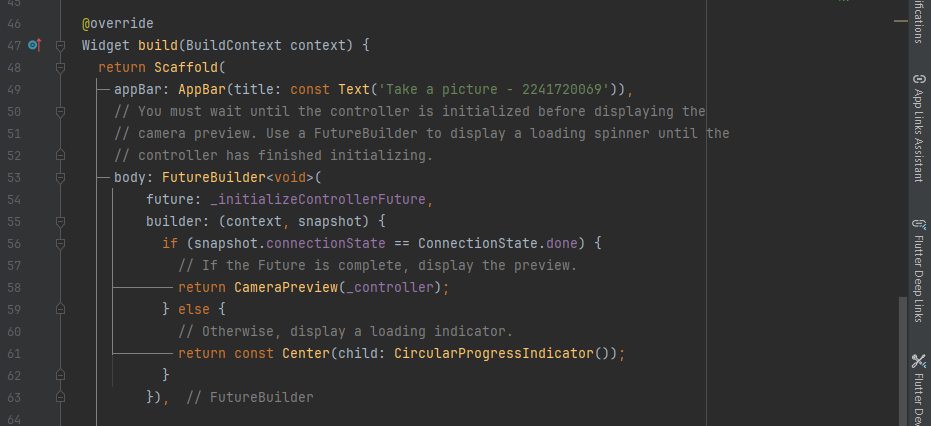


#### Langkah 6: Ambil foto dengan CameraController
Anda dapat menggunakan CameraController untuk mengambil gambar menggunakan metode takePicture(), yang mengembalikan objek XFile, merupakan sebuah objek abstraksi File lintas platform yang disederhanakan. Pada Android dan iOS, gambar baru disimpan dalam direktori cache masing-masing, dan path ke lokasi tersebut dikembalikan dalam XFile.


Pada codelab ini, buatlah sebuah FloatingActionButton yang digunakan untuk mengambil gambar menggunakan CameraController saat pengguna mengetuk tombol.

Pengambilan gambar memerlukan 2 langkah:

1. Pastikan kamera telah diinisialisasi.
2. Gunakan controller untuk mengambil gambar dan pastikan ia mengembalikan objek Future.

Praktik baik untuk membungkus operasi kode ini dalam blok try / catch guna menangani berbagai kesalahan yang mungkin terjadi.

Kode berikut letakkan dalam Widget build setelah field body.

**lib/widget/takepicture_screen.dart**

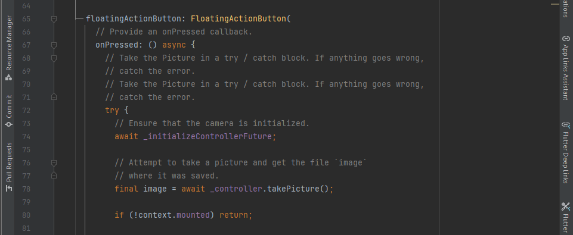

#### Langkah 7: Buat widget baru DisplayPictureScreen
Buatlah file baru pada folder widget yang berisi kode berikut.

**lib/widget/displaypicture_screen.dart**
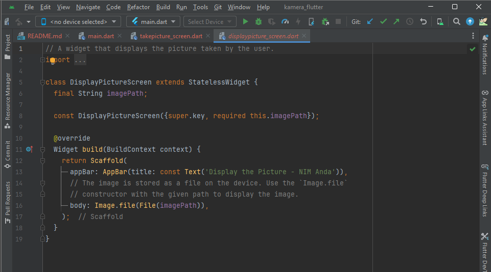


#### Langkah 8: Edit main.dart
Edit pada file ini bagian runApp seperti kode berikut.

**lib/main.dart**

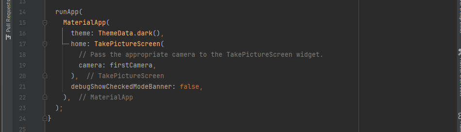

#### Langkah 9: Menampilkan hasil foto
Tambahkan kode seperti berikut pada bagian try / catch agar dapat menampilkan hasil foto pada DisplayPictureScreen.

**lib/widget/takepicture_screen.dart**

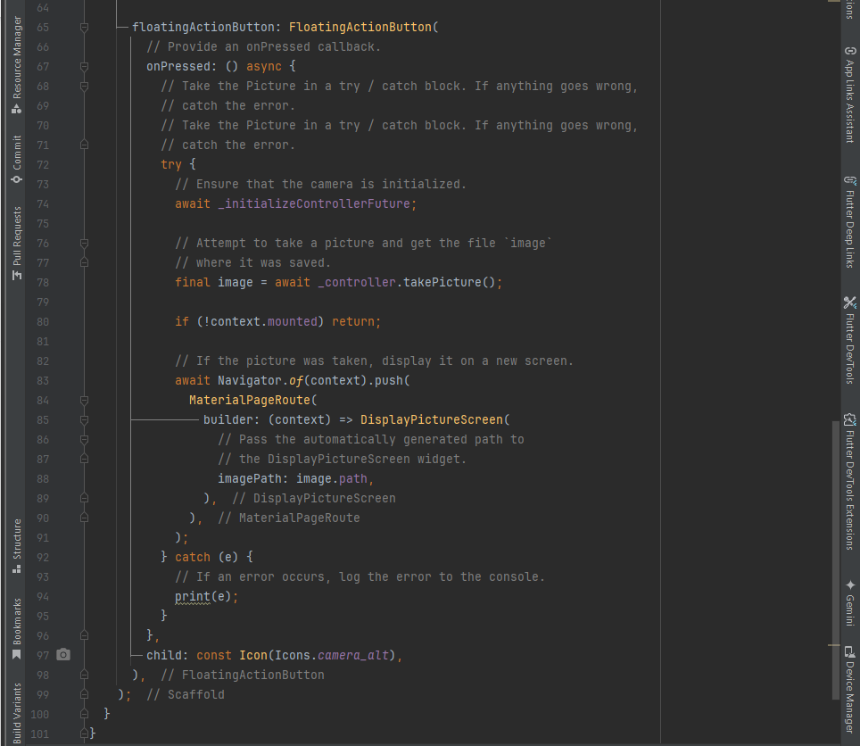

### Hasil Praktikum


## Praktikum 2 - Membuat photo filter carousel
Semua orang tahu bahwa foto akan terlihat lebih bagus dengan filter. Pada codelab ini, Anda akan membuat rangkaian pilihan filter yang dapat digeser sesuai pilihan warna.

Berikut ini menunjukkan aplikasi yang akan Anda buat:

---

Selesaikan langkah-langkah praktikum berikut ini.

#### Langkah 1: Buat project baru
Buatlah project flutter baru di pertemuan 09 dengan nama  `photo_filter_carousel`

#### Langkah 2: Buat widget Selector ring dan dark gradient
Buatlah folder widget dan file baru yang berisi kode berikut.

**lib/widget/filter_selector.dart**

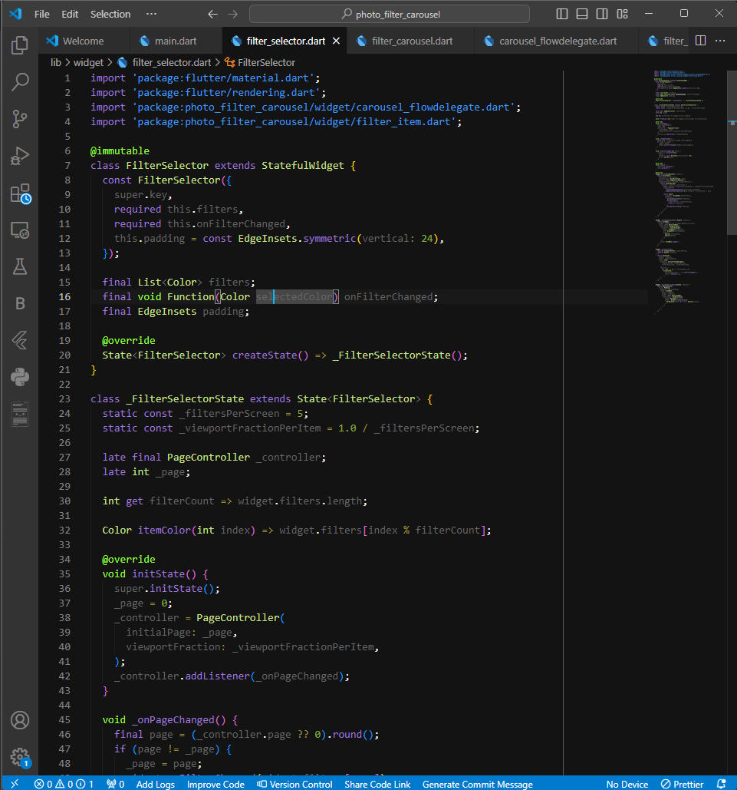


### Langkah 3: Buat widget photo filter carousel
Buat file baru di folder widget dengan kode seperti berikut.

**lib/widget/filter_carousel.dart**

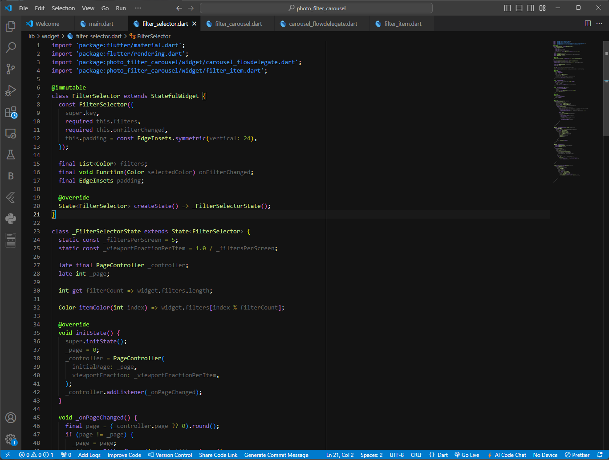


#### Langkah 4: Membuat filter warna - bagian 1
Buat file baru di folder widget seperti kode berikut.

**lib/widget/carousel_flowdelegate.dart**

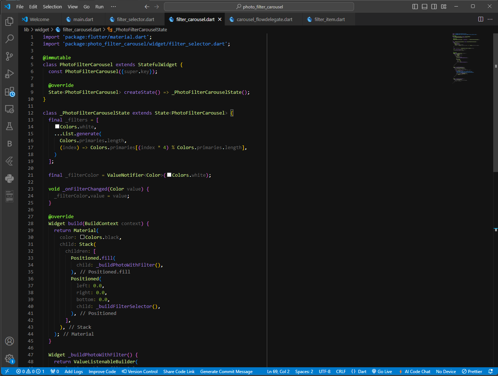

#### Langkah 5: Membuat filter warna
Buat file baru di folder widget seperti kode berikut ini.

**lib/widget/filter_item.dart**

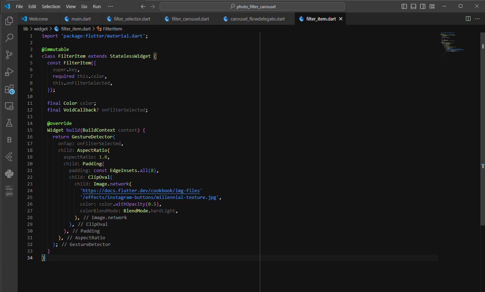

#### Langkah 6: Implementasi filter carousel
Terakhir, kita impor widget PhotoFilterCarousel ke main seperti kode berikut ini.

**lib/main.dart**

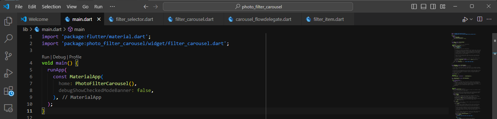

#### Troubleshoot
Jika diperlukan, beberapa widget yang telah Anda buat sebelumnya, memerlukan kode import berikut ini.

```dart
import 'dart:math' as math;

import 'package:flutter/material.dart';
import 'package:flutter/rendering.dart' show ViewportOffset;
```

#### Hasil Praktikum

.gif>)


# Tugas Praktikum
---
1. Selesaikan Praktikum 1 dan 2, lalu dokumentasikan dan push ke repository Anda berupa screenshot setiap hasil pekerjaan beserta penjelasannya di file README.md! Jika terdapat error atau kode yang tidak dapat berjalan, silakan Anda perbaiki sesuai tujuan aplikasi dibuat!
2. Gabungkan hasil praktikum 1 dengan hasil praktikum 2 sehingga setelah melakukan pengambilan foto, dapat dibuat filter carouselnya!
    > **Jawaban** : <br> Untuk kode bisa dilihat di folder project kamera_flutter

    .gif>)

1. Jelaskan maksud void async pada praktikum 1?
    > **Jawaban** : <br>
    > Dengan menggunakan `async`, kita memastikan bahwa semua fungsi yang membutuhkan data kamera (seperti memilih kamera pertama) sudah selesai dieksekusi sebelum aplikasi dijalankan dengan `runApp()`. `void async` membantu mengatur urutan proses asinkron selama inisialisasi kamera, sehingga aplikasi berjalan lancar tanpa error akibat kamera yang belum siap saat aplikasi mulai dijalankan.
1. Jelaskan fungsi dari anotasi @immutable dan @override ?
    >  **Jawaban** : <br>
    > - `@immutable`: Menandai kelas sebagai immutable (tidak bisa diubah setelah objek dibuat). Umumnya digunakan pada widget stateless di Flutter agar propertinya tidak berubah, menjaga kestabilan objek.<br>
    > - `@override`: Menandai bahwa metode dalam kelas adalah hasil penimpaaan dari metode di kelas induk. Ini membantu menghindari kesalahan dengan memastikan metode yang ditulis ulang sesuai dengan yang ada di superclass.

1. Kumpulkan link commit repository GitHub Anda kepada dosen yang telah disepakati!


