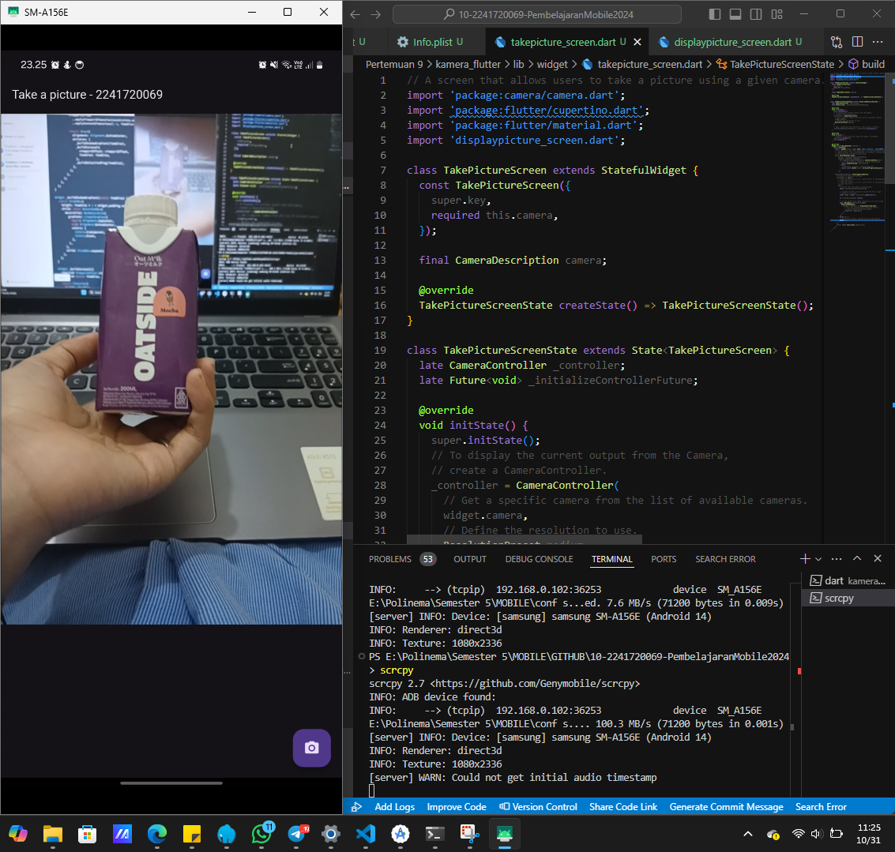

<table>
    <thead>
        <th style="text-align: center;" colspan="2">Data Diri</th>
    </thead>
    <tbody>
        <tr>
            <td>Nama</td>
            <td>Icha Dewi Putriana</td>
        </tr>
        <tr>
            <td>Nim</td>
            <td>2241720069</td>
        </tr>
    </tbody>
</table>

 

# Hasil Praktikum Pertemuan - 9

Untuk Laporan lebih lengkap bisa dilihat di [Laporan Praktikum untuk pertemuan 9](https://github.com/ichaputri/10-2241720069-PembelajaranMobile2024/blob/cbd95e4faba2c9512f6b40152e53d1729d0329f3/Pertemuan%209/LaporanPraktikum.md)

---

## Kamera Flutter

## Photo_filter_caraousel
.gif>)

## Tugas Praktikum
Gabungan antara kamera flutter dan photo filter carousel
.gif>)
